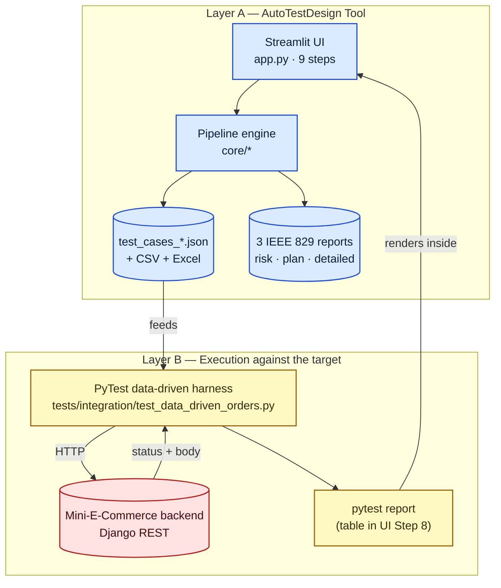
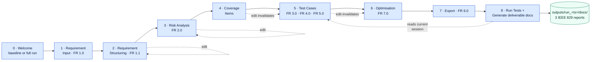
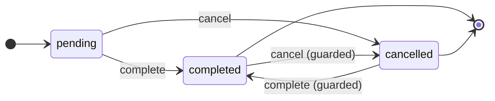
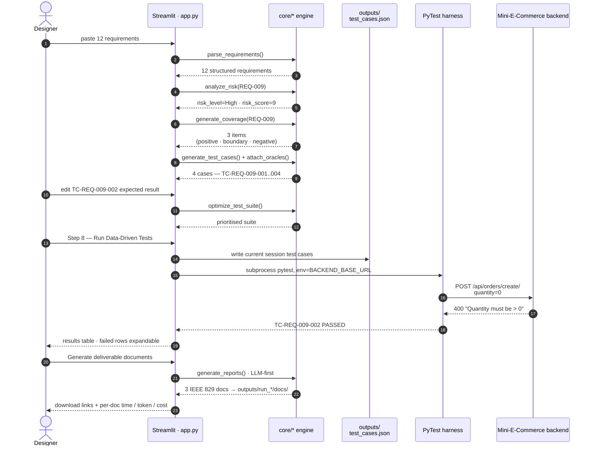
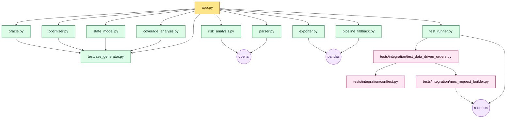

# Architecture

## Abstract

This document records the architecture of the AutoTestDesign system.
Six visual representations are provided: the two-layer testing model,
the internal architecture of the tool, the nine-step user-interface
workflow, the white-box state machine, an end-to-end runtime trace for
one requirement, and the module dependency graph. The repository
layout is recorded as a final reference. Every diagram is authored in
Mermaid and renders natively in the principal Markdown viewers.

---

## 1. Two-Layer Testing Model

The architecture is organised around a strict separation between the
*tool that designs the tests* and the *tests that exercise the target
application*. The separation is summarised in Figure 1.



*Figure 1.* The two-layer testing model.

Layer A is responsible for producing evidence in the form of
structured test artefacts. Layer B is responsible for translating
that evidence into verdicts. Step 8 of the user interface closes the
loop by triggering the PyTest run from within the same browser
session that produced the artefacts. Once a run has been recorded,
Layer A additionally renders the three IEEE 829 deliverable reports —
the risk-analysis report, the test plan, and the detailed test design
and execution report — embedding the execution results so that the
documents are evidence-backed rather than hand-written.

---

## 2. Tool Internal Architecture

The internal organisation of the tool is summarised in Figure 2. The
user interface is a thin scheduler; the substantive functionality is
distributed among the modules of `core/`.

```mermaid
flowchart LR
    classDef llm   fill:#dbeafe,stroke:#1d4ed8,color:#0c1e3f
    classDef rule  fill:#dcfce7,stroke:#15803d,color:#052e1d
    classDef ui    fill:#fde68a,stroke:#b45309,color:#3a2a06
    classDef out   fill:#ecfdf5,stroke:#047857,color:#022c22
    classDef ext   fill:#f3e8ff,stroke:#7e22ce,color:#2c0d52

    Input[/"requirement text<br/>(form / CSV / .json)"/]
    Env[/".env<br/>API_KEY · BASE_URL · MODEL"/]

    subgraph uiLayer ["UI layer · app.py"]
        Scheduler["scheduler functions<br/>parse_with_fallback · ..."]
        Editor["st.data_editor × 5<br/>interactive review"]
    end

    subgraph engine ["core/ pipeline engine"]
        Parser["parser.py<br/>LLM parser"]
        Risk["risk_analysis.py<br/>LLM risk analyser"]
        Fallback["pipeline_fallback.py<br/>deterministic fallback"]
        Coverage["coverage_analysis.py<br/>constraint → coverage items"]
        TestGen["testcase_generator.py<br/>EP · BVA · DT"]
        Oracle["oracle.py<br/>structured oracle (FR 5.0)"]
        StateModel["state_model.py<br/>state transition (FR 4.0)"]
        Optimizer["optimizer.py<br/>prioritise · minimise"]
        Exporter["exporter.py<br/>CSV · JSON · Excel"]
        Runner["test_runner.py<br/>subprocess pytest"]
        Reports["report_pipeline.py<br/>LLM-first deliverable docs<br/>(report_llm.py · report_generator.py fallback)"]
    end

    Outputs[("outputs/run_&lt;ts&gt;/<br/>test_cases_*.json · CSV · xlsx<br/>+ docs/ (IEEE 829 reports)")]
    Backend[/"Mini-E-Commerce backend"/]

    Input --> Scheduler
    Env -.-> Parser
    Env -.-> Risk

    Scheduler --> Parser
    Scheduler --> Risk
    Parser -. "API failure" .-> Fallback
    Risk   -. "API failure" .-> Fallback
    Parser --> Coverage
    Fallback --> Coverage
    Coverage --> TestGen
    Risk --> TestGen
    TestGen --> Oracle
    StateModel --> TestGen
    Oracle --> Optimizer
    Optimizer --> Exporter
    Scheduler --> Runner
    Scheduler --> Reports
    Env -.-> Reports
    Editor -. "edits invalidate downstream" .- Scheduler

    Exporter --> Outputs
    Runner --> Backend
    Runner --> Outputs
    Reports --> Outputs

    class Parser,Risk,Reports llm
    class Coverage,TestGen,Oracle,StateModel,Optimizer,Exporter,Runner,Fallback rule
    class Scheduler,Editor ui
    class Outputs out
    class Backend,Input,Env ext
```



*Figure 2.* Internal architecture of the tool. Legend below.

**Table 1.** Legend for Figure 2.

| Colour | Meaning |
|---|---|
| Blue | LLM-driven node (with deterministic fallback) |
| Green | Deterministic rule engine |
| Yellow | User interface / orchestration |
| Mint | Persistent output artefact |
| Purple | External boundary (input / backend) |

The report subsystem (`report_pipeline.py`) is the third and final
LLM-backed stage. Like the parser and the risk analyser it is
*LLM-first with a deterministic fallback*: when a model is configured
it drives `report_llm.py` (one prompt per document under `prompts/`),
and when no model is reachable it degrades to `report_generator.py`,
which renders the same IEEE 829 section structure from the in-memory
pipeline artefacts. Every other node in the engine is reproducible
rule code.

---

## 3. Nine-Step Workflow

The Streamlit user interface exposes the pipeline as a guided nine-
step workflow, summarised in Figure 3. The dotted edges indicate the
interactive-review behaviour: an upstream edit invalidates the cached
downstream artefacts.



*Figure 3.* Nine-step workflow exposed by the user interface.

Dotted edges represent interactive review: an upstream edit
invalidates the cached downstream artefacts, which are regenerated on
the next visit. Step 8 reads the current session's test cases
directly, so editing a coverage item in Step 4 changes what is sent
to the backend in Step 8 without leaving the browser.

Step 8 carries a second responsibility. Once at least one run has
been recorded, a gated *Generate deliverable documents* control
renders the three IEEE 829 reports into
`outputs/run_<timestamp>/docs/`, embedding that run's execution
results. Because the documents quote real verdicts they can only be
produced after a run, which is why generation lives at the end of the
workflow rather than alongside the export at Step 7.

---

## 4. White-Box State Machine (FR 4.0)

The Order status machine in
[target_app/Mini-E-Commerce-System/Backend/store/models.py](../target_app/Mini-E-Commerce-System/Backend/store/models.py)
is encoded in
[data/order_state_model.json](../data/order_state_model.json) and
exposed by the test-case generation step in the UI. The model declares
two valid transitions and two guard edges that the implementation must
reject.



*Figure 4.* Order status state machine encoded for FR 4.0.

Each coverage criterion produces a deterministic number of test
cases, recorded in Table 2.

**Table 2.** Cases produced under each criterion.

| Criterion | Cases |
|---|---:|
| All states | 2 |
| All valid transitions | 2 |
| All transitions + invalid guards | 4 (2 valid + 2 negative) |

The generated cases share the JSON shape of the black-box engine and
therefore flow through the optimiser, exporter, and in-UI runner
without adaptation.

---

## 5. End-to-End Runtime Trace

To make the runtime behaviour concrete, Figure 5 records the sequence
of interactions that follow REQ-009 (*reject an order whose quantity
exceeds stock*) through the entire system.



*Figure 5.* End-to-end runtime trace for REQ-009.

The trace records the canonical closed loop: the tool produces
evidence, the tester reviews and edits it, the harness executes it
against the running backend, and the verdicts return to the same
interface.

---

## 6. Module Dependency Graph

Figure 6 presents the import graph of the modules. It distinguishes
the user-interface layer, the deterministic core engine, the external
dependencies, and the test infrastructure.



---

## 7. Repository Layout

The on-disk organisation of the project is summarised below.

```
.
├── app.py                                # Streamlit UI (9 steps)
├── core/
│   ├── parser.py                         # LLM parser
│   ├── risk_analysis.py                  # LLM risk analyser
│   ├── pipeline_fallback.py              # deterministic rule pipeline
│   ├── coverage_analysis.py              # constraint → coverage items
│   ├── testcase_generator.py             # EP / BVA / DT engine
│   ├── state_model.py                    # white-box state coverage (FR 4.0)
│   ├── oracle.py                         # structured oracle (FR 5.0)
│   ├── optimizer.py                      # prioritise + minimise (FR 7.0)
│   ├── exporter.py                       # CSV / JSON / Excel writers
│   ├── test_runner.py                    # in-UI pytest subprocess
│   ├── report_pipeline.py                # orchestrates deliverable-doc generation
│   ├── report_llm.py                     # LLM-first report writer (per-doc prompt)
│   ├── report_generator.py               # deterministic report fallback (IEEE 829)
│   ├── run_context.py                    # per-run outputs/run_<ts>/ directories
│   └── utils.py                          # loaders, JSON helpers
├── prompts/                              # LLM system prompts (pipeline + reports)
├── schema/                               # JSON schema files
├── data/
│   ├── mini_ecommerce_requirements.json  # canonical dataset
│   ├── order_state_model.json            # FR 4.0 state machine
│   ├── baseline/                         # reproducible pipeline output
│   └── sample_*.json                     # unit-test fixtures
├── target_app/Mini-E-Commerce-System/    # target backend (Django REST)
├── tests/
│   ├── unit/                             # engine / optimiser / etc unit tests
│   └── integration/
│       ├── conftest.py                   # shared fixtures and backend probe
│       ├── mec_request_builder.py        # test case → HTTP template
│       ├── test_data_driven_orders.py    # generated cases → backend
│       ├── test_mini_ecommerce_api.py    # product CRUD checks
│       ├── test_order_api.py             # order create/read checks
│       └── test_order_status_api.py      # order status transitions
├── scripts/
│   ├── benchmark.py                      # measures latency and LLM cost
│   ├── build_traceability.py             # regenerates traceability_matrix.md
│   └── run_offline_tests.py              # persists the offline run result
├── docs/                                 # this folder
├── outputs/                              # per-run artefacts
│   └── run_<timestamp>/
│       ├── docs/                         # generated IEEE 829 deliverable reports
│       ├── data/                         # exported CSV / JSON / Excel
│       └── runs/                         # transient pytest payloads (gitignored)
└── screenshots/                          # workflow screenshots
```

---

## References

- ISO/IEC/IEEE 29119-2:2021, *Software and systems engineering — Software testing — Part 2: Test processes*.
- ISO/IEC/IEEE 29119-4:2021, *Part 4: Test techniques*.
- International Software Testing Qualifications Board (ISTQB), *Foundation Level Syllabus*, 2018.
