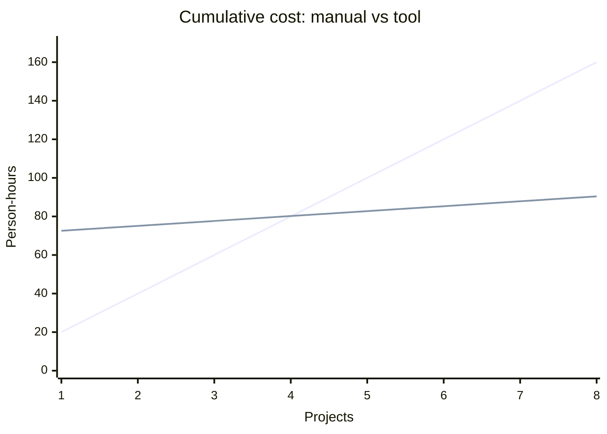

# Cost Estimation

## Abstract

This report estimates the cost of designing and executing a test
suite for the target application using AutoTestDesign and compares
that cost with the equivalent manual effort. The cost model separates
the one-off cost of constructing the tool from the recurring per-
project cost of using it, since the two scale differently and the
break-even point depends on their ratio. Token-related figures are
obtained from
[benchmark_report.md](benchmark_report.md), which records exact
counts from the provider's `usage` field and is therefore
reproducible.

---

## 1. Introduction

The economic justification for a test-design tool is that the marginal
cost of designing a suite for one additional project, given the tool,
is significantly lower than the cost of designing the same suite by
hand. Demonstrating this rigorously requires three quantities: the
one-off cost of building the tool, the recurring per-project cost of
applying it, and the recurring per-project cost of the manual
alternative. The present report estimates the latter two from
direct measurement and the former from an explicit assumption.

---

## 2. Cost Model

Two cost categories are distinguished and reported separately.

**Table 1.** Cost categories.

| Category | Nature | Beneficiary |
|---|---|---|
| Tool construction | One-off | Paid once and amortised across every subsequent project. |
| Per-project use | Recurring | Paid each time the tool is applied to a new target. |

Manual testing has no construction cost but a recurring per-project
cost of roughly the manual design and execution effort. The tool
inverts this profile: it absorbs a larger up-front investment in
return for a marginal per-project cost approaching zero.

---

## 3. Per-Project Effort

The effort recorded in Table 2 corresponds to the design and execution
of a test suite for one target application comparable in size to the
Mini-E-Commerce backend (twelve requirements; approximately fifty
generated cases; approximately twenty-five cases focussed on the
order-creation workflow).

**Table 2.** Per-project effort (person-hours).

| Activity | Manual | With AutoTestDesign |
|---|---:|---:|
| Read and structure the requirements | 2.0 | 0.3 |
| Risk-rank the requirements | 1.5 | 0.2 |
| Identify the coverage items | 3.0 | 0.4 |
| Design the test cases (EP / BVA / DT) | 5.0 | 0.5 |
| State-transition design (FR 4.0) | 1.5 | 0.2 |
| Synthesise expected results / oracles | 2.0 | 0.2 |
| Prioritise and minimise the suite | 1.0 | 0.1 |
| Export to a test-management format | 0.5 | 0.05 |
| Construct executable tests | 3.0 | 0.5 |
| Execute and collect results | 0.5 | 0.1 |
| **Total** | **20.0** | **2.55** |

Application of the tool reduces the per-project design and execution
effort by approximately 87 % (20.0 → 2.55 person-hours). The
saving arises from the automation of the mechanical components of the
process — enumeration of coverage items, generation of boilerplate
test cases, synthesis of expected outcomes — while preserving the
tester's judgement at every editable step.

---

## 4. LLM Token Cost

### 4.1 Measurement procedure

The figures in this section are produced by
`scripts/benchmark.py` and persisted to
[benchmark_report.md](benchmark_report.md). They are read directly
from the provider's `usage` field and are therefore exact for the
configured model (`qwen3.6-flash`, `temperature=0`) and the twelve-
requirement input.

### 4.2 Token usage per session

**Table 3.** Token usage per session.

| Call | Calls per run | Input tokens | Output tokens |
|---|---:|---:|---:|
| Requirement parse (batch) | 1 | 2,577 | 2,996 |
| Risk analysis (per requirement) | 12 | 9,616 | 21,964 |
| **Total per run** | | **12,193** | **24,960** |

Input tokens are fixed by the prompts and the twelve-requirement
dataset, so they are identical across runs. Output tokens vary
slightly (by a few hundred) because the model's reasoning length is
not perfectly deterministic; the figures above are taken from the
latest run of the benchmark and the authoritative current values are
in [benchmark_report.md](benchmark_report.md).

### 4.3 Price applied

The published list price of `qwen3.6-flash` (input ≤ 256K tokens) is
recorded in Table 4.

**Table 4.** List price.

| Mode | Input (per 1M tokens) | Output (per 1M tokens) |
|---|---:|---:|
| Standard | ¥1.2 | ¥7.2 |
| Batch (half price) | ¥0.6 | ¥3.6 |

### 4.4 Cost per session

**Table 5.** Cost per session.

| Component | Tokens | Standard (¥) | Batch (¥) |
|---|---:|---:|---:|
| Input | 12,193 | 0.0146 | 0.0073 |
| Output | 24,960 | 0.1797 | 0.0898 |
| **Per full session** | 37,153 | **≈ 0.1943** | **≈ 0.0972** |

A complete pipeline run over twelve requirements costs approximately
¥0.19 at list price (approximately US$0.03), or about half that
amount under batch pricing. The risk stage dominates because it
issues one call per requirement and the four-dimension rationale is
verbose; batching, caching, or de-duplicating identical requirements
would reduce it further. Even after several dozen interactive
iterations, the cumulative LLM cost for the entire project remains
within a few yuan — immaterial in comparison with labour cost.

The coverage, test-case generation, oracle synthesis, and
optimisation stages issue no LLM calls; they are deterministic rule
engines and contribute zero token cost. Only requirement parsing and
risk analysis consume tokens.

---

## 5. Resource Cost

The non-labour resources required by the tool are listed in Table 6.

**Table 6.** Non-labour resources.

| Resource | Requirement |
|---|---|
| Compute | A laptop. Streamlit, the rule engines, and PyTest are lightweight; no GPU is required. |
| Network | Only the two LLM stages require it, and they fall back to deterministic rules when offline. |
| Storage | Output artefacts are of the order of kilobytes per run. |
| Software | All dependencies are open-source (Streamlit, pandas, PyTest, requests, the OpenAI SDK). |

---

## 6. Break-Even Analysis

Let *B* denote the one-off cost of constructing the tool in
person-hours, *M* the manual per-project cost, and *T* the
tool-assisted per-project cost. From the figures in §3,
*M* = 20.0 hours and *T* = 2.55 hours. The cumulative cost after
*n* projects is

```
manual cumulative     = M · n
tool cumulative       = B + T · n
break-even point n* = B / (M − T) = B / 17.45
```

If, for purposes of illustration, the tool is assumed to have taken
*B* = 70 person-hours to construct, the break-even point occurs at
approximately *n* = 4 projects. Each subsequent project then yields a
saving of approximately 17.45 hours. For a team or course that
applies the tool to several applications the investment is recovered
quickly. For a single one-off project the investment is approximately
break-even, in which case the non-cost benefits — reproducibility,
traceability, systematic coverage — become the deciding factors.



---

## 7. Qualitative Benefits

The hour-based comparison of §3 and §6 understates the value of the
tool because it does not price the following qualitative properties:

- **Reproducibility.** The rule engines produce identical output for
  identical input, so the suite is auditable and citable.
- **Traceability.** Every test traces to a requirement automatically
  (see [scripts/build_traceability.py](../scripts/build_traceability.py)),
  a task that is tedious and error-prone when performed by hand.
- **Coverage discipline.** Risk-based depth and systematic boundary
  and decision-table generation surface defects (such as the
  zero-quantity guard and the multi-item atomicity failure in
  [test_result_analysis.md](test_result_analysis.md)) that ad-hoc
  testing routinely misses.
- **Consistency.** Terminology, identifiers, and schemas are enforced
  uniformly, whereas manual authoring drifts over a large suite.

These properties are difficult to express in person-hours but they
are the qualities for which standards such as ISO/IEC/IEEE 29119-1
exist.

---

## 8. Conclusion

AutoTestDesign trades a modest one-off construction cost for an
approximately 87 % reduction in recurring per-project effort and a
negligible LLM cost (approximately ¥0.19 per full run). The
investment breaks even within a small number of projects and,
independently of the hour saving, delivers reproducibility, automatic
traceability, and systematic coverage that manual test design cannot
match at the same cost.

---

## References

- ISO/IEC/IEEE 29119-1:2022, *Software and systems engineering — Software testing — Part 1: General concepts*.
