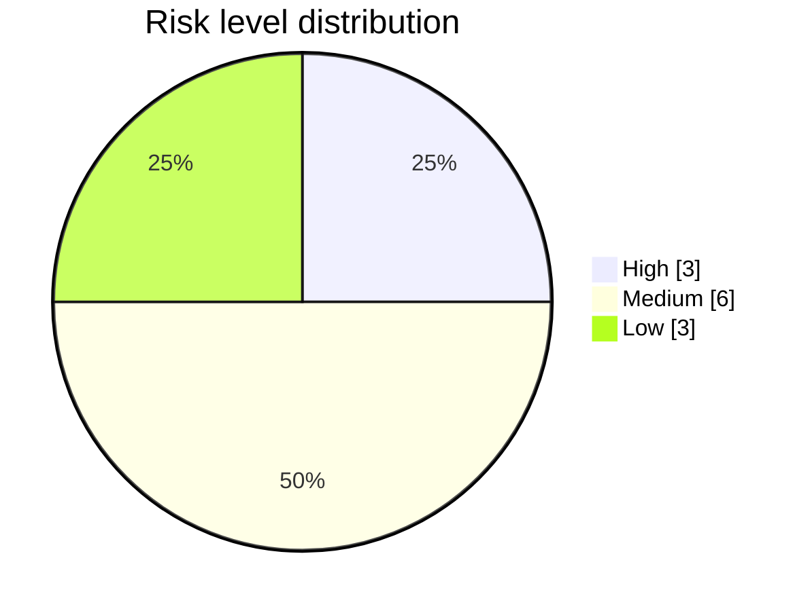

# Risk Analysis Report — Mini-E-Commerce Backend

> **Subject:** the **target application** — a Django REST Mini-E-Commerce
> backend — **not** the AutoTestDesign tool.
> **Produced by:** the AutoTestDesign risk module (LLM analysis with a
> deterministic rule fallback). This hand-authored document is the gold
> reference; the tool emits an equivalent report per run into
> `outputs/run_<timestamp>/docs/risk_analysis_report.md`.

## Abstract

This report presents a risk-based analysis of the target application. Each
of the twelve catalogued requirements is rated on four independent
product-risk dimensions; the ratings are combined into a single score that
is mapped to a risk level. The resulting register orders the requirements
by the test effort each should receive, in accordance with the risk-based
testing principle of ISO/IEC/IEEE 29119-1 and the ISTQB foundation-level
syllabus. The register's predictive power is corroborated by the discovery
of three real defects — two in the High-risk order-creation workflow and
one in the order-status machine — each detected, repaired, and re-verified
under the suite described in
[test_result_analysis.md](test_result_analysis.md). The method is shown to
be application-independent (§9), satisfying the *generalisability* element
of the assessment.

---

## 1. Report identifier

| Field | Value |
|---|---|
| Report | Risk Analysis Report — Mini-E-Commerce Backend |
| Version | 2.0 (IEEE 829-aligned) |
| Target application | Django REST Mini-E-Commerce backend |
| Scope | REQ-001 … REQ-012 ([data/mini_ecommerce_requirements.json](../data/mini_ecommerce_requirements.json)) |
| Tool | AutoTestDesign risk module (`core/risk_analysis.py`, rule fallback `core/pipeline_fallback.py`) |
| Related documents | [test_plan.md](test_plan.md), [detailed_test_design_execution.md](detailed_test_design_execution.md), [test_result_analysis.md](test_result_analysis.md), [coverage_strategy.md](coverage_strategy.md) |

---

## 2. Introduction

Risk-based testing (ISTQB 2018; ISO/IEC/IEEE 29119-1) directs test effort
towards areas where a defect is both *likely* and *damaging*. Its
effectiveness depends on the discriminative power of the underlying risk
model: a model that classifies every requirement as High risk provides no
guidance, while one that classifies every requirement as Low risk leaves
serious failures uncovered. The present analysis adopts the four-dimension
model described in §3 and demonstrates, by the discovery of three real
defects (§7), that the resulting ranking is predictive on the target
application.

The report addresses the assessment criteria as follows: **concept
understanding** through the explicit risk model of §3; **design–
implementation consistency** through §3.2, which shows the scoring rule is
literally the code that runs; **coverage** through the complete twelve-row
register of §4–§5; and **depth of analysis** through the predictive-validity
evidence of §7 and the generalisability argument of §9. A section-to-
criterion map is given in Appendix A.

---

## 3. Risk assessment method

### 3.1 Subject and interface

The backend exposes a product catalogue and an order workflow through the
following endpoints.

```
GET    /api/products/            POST   /api/orders/create/
POST   /api/products/create/     GET    /api/orders/<id>/
GET    /api/products/<id>/       PATCH  /api/orders/<id>/
PATCH  /api/products/<id>/       GET    /api/orders/
DELETE /api/products/<id>/
```

### 3.2 Scoring model

Each requirement is rated on four dimensions, each on an integer scale of
1 (low), 2 (medium), 3 (high).

**Table 1.** Risk dimensions.

| Dimension | Question addressed |
|---|---|
| `business_impact` | How essential is the feature to the business? |
| `failure_probability` | How likely is an undetected defect, given input and state complexity? |
| `complexity` | How complex are the input space and the logic? |
| `failure_impact` | How damaging would an undetected defect be? |

The headline `risk_score` is **computed**, not elicited: the sum of the
four ratings (range 4–12) is linearly rescaled onto the canonical interval
1–10 by `score = round((sum − 4) / 8 × 9 + 1)`. The minimum score is
therefore 1 and the maximum 10; the value 0 cannot occur. The level then
follows the conventional mapping of Table 2
([STYLE_GUIDE.md](STYLE_GUIDE.md) §4.2).

**Table 2.** Score-to-level mapping (applied to the rescaled `risk_score`).

| `risk_score` | Level | Raw four-dimension sum |
|---|---|---|
| 1 – 3 | Low | 4 – 5 |
| 4 – 7 | Medium | 6 – 9 |
| 8 – 10 | High | 10 – 12 |

Because the score is a transparent function of the dimensions, the headline
value, the per-dimension ratings, and the prose justifications remain
mutually consistent. The full record is persisted to
[data/baseline/risk_llm.json](../data/baseline/risk_llm.json), so the
register below is reproducible without re-invoking the model. The same
combination rule (`score_from_dimensions` in `core/risk_analysis.py`) is
used by both the live LLM path and the deterministic fallback — the model
supplies four ratings, the code computes everything downstream — which is
the basis of the design–implementation consistency claimed in §2.

---

## 4. Risk register

**Table 3.** Risk register (sorted by requirement id).

| Requirement | Feature | Level | Score |
|---|---|---|---:|
| REQ-001 | Product catalogue listing | Low | 2 |
| REQ-002 | Product detail by id | Low | 2 |
| REQ-003 | Admin creates a product | Medium | 7 |
| REQ-004 | Admin updates a product | High | 8 |
| REQ-005 | Admin deletes a product | Medium | 7 |
| REQ-006 | Customer creates an order | High | 9 |
| REQ-007 | Reject empty order | Medium | 7 |
| REQ-008 | Reject order with missing customer info | Medium | 4 |
| REQ-009 | Reject order whose quantity exceeds stock | Medium | 7 |
| REQ-010 | Reduce stock after successful order | High | 9 |
| REQ-011 | Customer views order detail | Low | 2 |
| REQ-012 | Admin updates order status | Medium | 6 |

---

## 5. Risk distribution

**Table 4.** Risk distribution.

| Level | Count | Requirements |
|---|---:|---|
| High | 3 | REQ-004, REQ-006, REQ-010 |
| Medium | 6 | REQ-003, REQ-005, REQ-007, REQ-008, REQ-009, REQ-012 |
| Low | 3 | REQ-001, REQ-002, REQ-011 |



The spread (3 / 6 / 3) is itself evidence that the model is discriminating
rather than degenerate: it neither inflates everything to High nor deflates
everything to Low.

---

## 6. High-risk requirements

Three requirements receive the High classification (scores 8 and 9). For
each, the dominant dimensions are quoted from the analyser output and the
resulting test focus is recorded.

### 6.1 REQ-004 — Admin updates a product (score 8)

- *business_impact high*: a core data edit that directly controls pricing
  and inventory visibility across the platform.
- *failure_impact high*: incorrect product data propagates to storefronts
  and checkout, causing financial or reputational damage.
- *failure_probability / complexity medium*: a multi-field update with
  existence and type checks, where edge cases hide.

**Test focus.** Existence guard on the product identifier (404 on a missing
id); valid partial update accepted; numeric validation for `price` and
`stock`.

### 6.2 REQ-006 — Customer creates an order (score 9)

- *business_impact high*: order creation drives revenue and inventory
  tracking — the core transactional function.
- *failure_probability high*: multiple required fields and range
  constraints form a critical validation boundary.
- *failure_impact high*: a defect causes lost sales, incorrect inventory
  deductions, or corrupted customer records.

**Test focus.** Single- and multi-item happy paths; `total_price`
arithmetic verified with `Decimal`; the rejection rules of REQ-007/008/009.

### 6.3 REQ-010 — Reduce stock after successful order (score 9)

- *business_impact high*: stock reduction is fundamental to fulfilment and
  to preventing overselling.
- *failure_probability high*: a stateful mutation combined with a critical
  boundary guard (`stock >= 0`), prone to race conditions or bypasses.
- *failure_impact high*: incorrect stock causes overselling, inventory
  discrepancies, and financial loss.

**Test focus.** Stock decreases by the exact ordered quantity on success;
stock remains untouched after a rejected order — an invariant that guards
against silent data loss.

---

## 7. Medium- and Low-risk requirements

**Table 5.** Medium- and Low-risk requirements with the dominant dimension.

| Requirement | Level | Score | Dominant dimension |
|---|---|---:|---|
| REQ-003 Admin creates a product | Medium | 7 | High business/failure impact; admin write that seeds the catalogue. |
| REQ-005 Admin deletes a product | Medium | 7 | Irreversible admin action; high failure impact, single-id operation. |
| REQ-007 Reject empty order | Medium | 7 | Validation guard on the order path; high failure probability and impact. |
| REQ-009 Reject over-stock order | Medium | 7 | Guards the stock boundary; high failure impact, low input complexity. |
| REQ-012 Admin updates order status | Medium | 6 | Order-lifecycle control; enumeration keeps complexity low. |
| REQ-008 Reject missing customer info | Medium | 4 | Presence checks on three string fields; bounded blast radius. |
| REQ-001 Product catalogue listing | Low | 2 | Read-only public data, simple GET, no integrity risk. |
| REQ-002 Product detail by id | Low | 2 | Read-only single-id lookup, minor UX impact on failure. |
| REQ-011 Customer views order detail | Low | 2 | Read-only single-id lookup; authorisation hardening noted in §10. |

---

## 8. Risk-to-coverage strategy

The risk level determines the *coverage depth* of each requirement, per the
rule in [coverage_strategy.md](coverage_strategy.md) §4.

**Table 6.** Risk-to-depth mapping.

| Level | Coverage depth |
|---|---|
| High | Every generated case is retained; boundary, negative, and decision-table cases are favoured. |
| Medium | One representative is retained per coverage type, together with all decision-table cases. |
| Low | Cases are deduplicated by coverage type; at least one case is always retained. |

The three High-risk requirements — all on the order workflow — therefore
receive the deepest coverage. This is the locus at which a defect would
carry the greatest cost and, as §9 records, the locus at which two of the
three detected defects were in fact found, with the third arising in the
order-status state machine.

---

## 9. Evidence: defects found by the designed suite

Three real defects were detected in the order-handling modules. All three
were repaired and re-verified by the procedure in
[test_result_analysis.md](test_result_analysis.md). Table 7 summarises each;
the full design and execution narrative is in
[detailed_test_design_execution.md](detailed_test_design_execution.md).

**Table 7.** Defects detected by the risk-prioritised suite.

| Defect | Detected by | Requirement | Symptom | Repair |
|---|---|---|---|---|
| 1 — non-positive quantity accepted | Boundary Value Analysis | REQ-009 | HTTP 201 where 400 expected | Lower-bound guard at `views.py:102` |
| 2 — stock leak on multi-item partial failure | Decision-table / cross-condition invariant | REQ-006 + REQ-010 | HTTP 400 but stock silently decremented | `@transaction.atomic` + `set_rollback(True)` on every 4xx path |
| 3 — terminal order accepts further status change | State-transition testing (white box) | REQ-012 | HTTP 200 where the transition should be rejected | Transition guard in `OrderDetailAPIView.update` |

The detection of these defects corroborates the predictive value of the
register. Two lie in the High-risk cluster (REQ-006, REQ-010, the
highest-scored requirements). The third lies in a Medium-risk requirement
(REQ-012); it was reached not by score-driven prioritisation but by the
white-box state-transition technique that the model assigns to requirements
carrying a state machine — evidence that risk ranking and technique
selection are **complementary rather than redundant**. This is the
analytical core of the report's *coverage effectiveness* and *depth of
analysis* contributions.

---

## 10. Mitigation recommendations

The following recommendations target the dimensions that drove the High
scores. They are out of scope for the present plan but recorded for future
iterations.

**Table 8.** Mitigation recommendations.

| Area | Recommendation |
|---|---|
| Order workflow (REQ-006, REQ-009, REQ-010) | Keep the order handler atomic (applied for Defect 2); audit other multi-statement handlers for the same anti-pattern. |
| Destructive admin actions (REQ-005) | Introduce authentication, authorisation and an audit trail before delete reaches production. |
| Order-detail exposure (REQ-011) | Enforce per-customer authorisation so one customer cannot read another's order. |
| Input validation (REQ-007, REQ-008, REQ-009) | Centralise validation in the serialiser layer so every entry point is guarded consistently. |

---

## 11. Generalisability of the method

The scoring model is not specific to e-commerce. The four dimensions are
generic product-risk factors recognised by both ISO/IEC/IEEE 29119-1 and
the ISTQB syllabus, and the score→level→depth chain is a standard
risk-based-testing pipeline. To risk-rank a different application the tester
supplies its requirements in the schema-v1 form; the same prompt and the
same deterministic combination rule then produce a comparable register.
Because the headline score is computed from the ratings rather than elicited
from the model, the method is reproducible and auditable on any requirement
set. This argument is the report's contribution to the *depth of analysis /
generalisability* criterion.

---

## 12. Limitations

The ratings remain LLM-derived judgements: `temperature=0` and the fixed
combination rule make them reproducible, but they are estimates, not
measurements, and may differ across models. The tool therefore permits the
tester to override any score before the suite is designed (the
human-in-the-loop review at Step 3 of the workflow). Security sensitivity is
assessed against the intended production architecture rather than the
current reference backend, which has no authentication; the mitigations of
§10 close that gap.

---

## References

- IEEE 829-2008, *Standard for Software and System Test Documentation*.
- ISO/IEC/IEEE 29119-1:2022, *Software testing — Part 1: General concepts*.
- ISO/IEC/IEEE 29119-2:2021, *Part 2: Test processes*.
- International Software Testing Qualifications Board (ISTQB), *Foundation Level Syllabus*, 2018.
