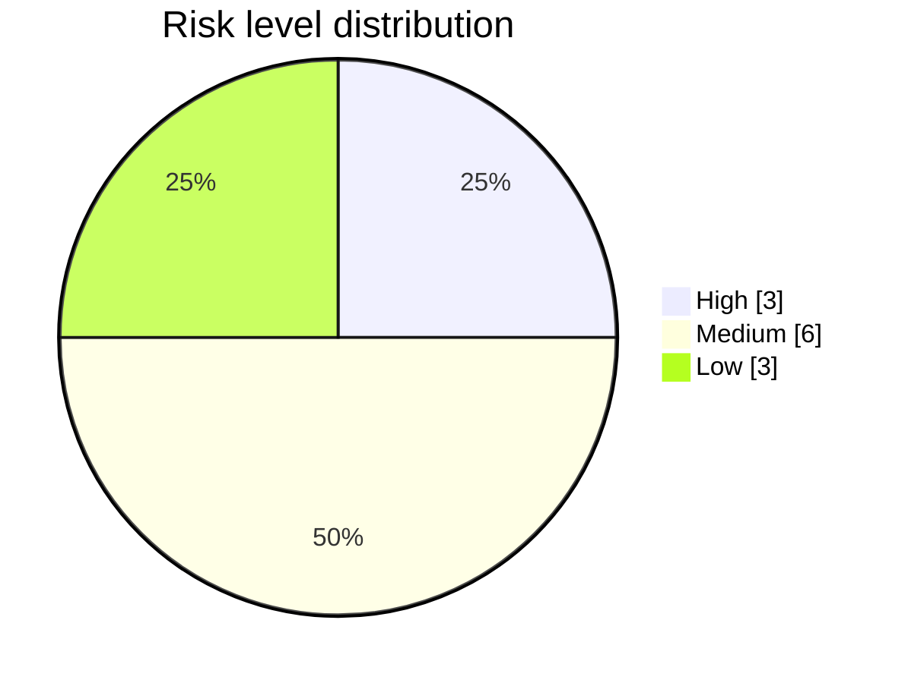

# Risk Analysis Report — Mini-E-Commerce Backend

## Abstract

This report presents a risk-based analysis of the target application —
the Django REST Mini-E-Commerce backend — performed with the
AutoTestDesign risk module. Each of the twelve catalogued
requirements is rated on four independent product-risk dimensions; the
ratings are combined into a single score that is then mapped to a
risk level. The resulting register orders the requirements by the
amount of test effort each should receive, in accordance with the
risk-based testing principle of ISO/IEC/IEEE 29119-1 and the
ISTQB foundation-level syllabus. The register's predictive power is
corroborated by the discovery of three real defects — two in the
High-risk order-creation workflow and one in the order-status
machine — each detected, repaired, and re-verified under the suite
described in [test_result_analysis.md](test_result_analysis.md).

---

## 1. Introduction

Risk-based testing (ISTQB 2018, ISO/IEC/IEEE 29119-1) directs test
effort towards areas where a defect is both likely and damaging. Its
effectiveness depends on the discriminative power of the underlying
risk model: a model that classifies every requirement as High risk
provides no guidance, while one that classifies every requirement as
Low risk leaves serious failures uncovered. The present analysis
adopts the four-dimension model described in §1.2 and demonstrates,
by the discovery of three real defects, that the resulting ranking is
predictive on the target application.

---

## 2. Scope and Method

### 2.1 Subject

The analysis covers the twelve requirements catalogued in
[data/mini_ecommerce_requirements.json](../data/mini_ecommerce_requirements.json).
The backend exposes a product catalogue and an order workflow through
the endpoints listed below.

```
GET    /api/products/            POST   /api/orders/create/
POST   /api/products/create/     GET    /api/orders/<id>/
GET    /api/products/<id>/       PATCH  /api/orders/<id>/
PATCH  /api/products/<id>/       GET    /api/orders/
DELETE /api/products/<id>/
```

### 2.2 Scoring model

Each requirement is rated by the language model on four dimensions,
each on an integer scale of 1 (low), 2 (medium), or 3 (high). Table 1
defines the dimensions.

**Table 1.** Risk dimensions.

| Dimension | Question addressed |
|---|---|
| `business_impact` | How essential is the feature to the business? |
| `failure_probability` | How likely is an undetected defect, given the input and state complexity? |
| `complexity` | How complex are the input space and the logic? |
| `failure_impact` | How damaging would an undetected defect be? |

The headline `risk_score` is computed from the four ratings rather
than elicited from the model: the sum of the four ratings, in the
inclusive range 4–12, is linearly rescaled onto the canonical
interval 1–10. The minimum achievable `risk_score` is therefore 1
(every dimension rated 1) and the maximum is 10 (every dimension
rated 3); the value 0 cannot occur. The risk level then follows the
conventional mapping (Table 2; [STYLE_GUIDE.md](STYLE_GUIDE.md) §4.2),
which applies to the rescaled `risk_score` and not to the raw sum.

**Table 2.** Score-to-level mapping (applied to the rescaled `risk_score`).

| `risk_score` | Level | Raw four-dimension sum |
|---|---|---|
| 1 – 3 | Low | 4 – 5 |
| 4 – 7 | Medium | 6 – 9 |
| 8 – 10 | High | 10 – 12 |

Because the score is a transparent function of the dimensions, the
headline value, the per-dimension ratings, and the prose justifications
must remain mutually consistent. The full record, including every
dimension rating, is persisted to
[data/baseline/risk_llm.json](../data/baseline/risk_llm.json), so the
register below is reproducible without re-invoking the model.

---

## 3. Risk Register

**Table 3.** Risk register.

| Requirement | Feature | Level | Score |
|---|---|---|---:|
| REQ-001 | Product catalogue listing | Low | 2 |
| REQ-002 | Product detail by id | Low | 2 |
| REQ-003 | Admin creates a product | Medium | 7 |
| REQ-004 | Admin updates a product | High | 8 |
| REQ-005 | Admin deletes a product | Medium | 7 |
| REQ-006 | Customer creates an order | High | 9 |
| REQ-007 | Reject empty order | Medium | 7 |
| REQ-008 | Reject order with missing customer info | Medium | 4 |
| REQ-009 | Reject order whose quantity exceeds stock | Medium | 7 |
| REQ-010 | Reduce stock after successful order | High | 9 |
| REQ-011 | Customer views order detail | Low | 2 |
| REQ-012 | Admin updates order status | Medium | 6 |

**Table 4.** Risk distribution.

| Level | Count | Requirements |
|---|---:|---|
| High | 3 | REQ-004, REQ-006, REQ-010 |
| Medium | 6 | REQ-003, REQ-005, REQ-007, REQ-008, REQ-009, REQ-012 |
| Low | 3 | REQ-001, REQ-002, REQ-011 |



---

## 4. High-Risk Requirements

Three requirements receive the High classification (scores 8 and 9).
For each, the dominant dimensions are quoted verbatim from the
analyser output and the resulting test focus is recorded.

### 4.1 REQ-004 — Admin updates a product (score 8)

- *business_impact high*: core data edit that directly controls
  pricing and inventory visibility across the platform.
- *failure_impact high*: incorrect product data propagates to
  storefronts and checkout, causing financial or reputational damage.
- *failure_probability / complexity medium*: a multi-field update with
  existence and type checks, of the kind where edge cases hide.

**Test focus.** Existence guard on the product identifier (404 on a
missing identifier); valid partial update accepted; numeric
validation for `price` and `stock`.

### 4.2 REQ-006 — Customer creates an order (score 9)

- *business_impact high*: order creation drives revenue and
  inventory tracking — the core transactional function.
- *failure_probability high*: multiple required fields and range
  constraints form a critical validation boundary where defects
  emerge.
- *failure_impact high*: a defect causes lost sales, incorrect
  inventory deductions, or corrupted customer records.

**Test focus.** Single-item and multi-item happy paths;
`total_price` arithmetic verified with `Decimal`; the rejection rules
specified by REQ-007, REQ-008, and REQ-009.

### 4.3 REQ-010 — Reduce stock after successful order (score 9)

- *business_impact high*: stock reduction is fundamental to fulfilling
  orders and preventing overselling.
- *failure_probability high*: a stateful mutation combined with a
  critical boundary guard (`stock >= 0`), prone to race conditions or
  validation bypasses.
- *failure_impact high*: incorrect stock levels cause overselling,
  inventory discrepancies, and financial loss.

**Test focus.** Stock decreases by the exact ordered quantity on
success; stock remains untouched after a rejected order — an invariant
that guards against silent data loss.

---

## 5. Medium- and Low-Risk Requirements

**Table 5.** Medium- and Low-risk requirements.

| Requirement | Level | Score | Dominant dimension |
|---|---|---:|---|
| REQ-003 Admin creates a product | Medium | 7 | High business impact and failure impact; admin write that seeds the catalogue. |
| REQ-005 Admin deletes a product | Medium | 7 | Irreversible administrative action; high failure impact, single-id operation. |
| REQ-007 Reject empty order | Medium | 7 | Validation guard on the order path; high failure probability and impact. |
| REQ-009 Reject over-stock order | Medium | 7 | Guards the stock boundary; high failure impact, low input complexity. |
| REQ-012 Admin updates order status | Medium | 6 | Order-lifecycle control; enumeration keeps complexity low. |
| REQ-008 Reject missing customer info | Medium | 4 | Presence checks on three string fields; bounded blast radius. |
| REQ-001 Product catalogue listing | Low | 2 | Read-only public data, simple GET, no integrity risk. |
| REQ-002 Product detail by id | Low | 2 | Read-only single-id lookup, minor UX impact on failure. |
| REQ-011 Customer views order detail | Low | 2 | Read-only single-id lookup; authorisation hardening noted in §7. |

---

## 6. Risk-to-Coverage Strategy

The test design uses the risk level to determine the *coverage depth*
of each requirement, in accordance with the rule defined in
[coverage_strategy.md](coverage_strategy.md) §4.

**Table 6.** Risk-to-depth mapping.

| Level | Coverage depth |
|---|---|
| High | Every generated case is retained; boundary, negative, and decision-table cases are favoured. |
| Medium | One representative is retained per coverage type, together with all decision-table cases. |
| Low | Cases are deduplicated by coverage type; at least one case is always retained. |

The three High-risk requirements — all on the order workflow (order
creation, stock reduction, product update) — therefore receive the
deepest coverage. This is the locus at which a defect would carry the
greatest cost, and, as §7 records, the locus at which two of the
three detected defects were in fact found, with the third arising in
the order-status state machine.

---

## 7. Evidence: Defects Found by the Designed Suite

Three real defects were detected in the order-handling modules. All
three were repaired and re-verified by the procedure documented in
[test_result_analysis.md](test_result_analysis.md). Table 7 summarises
each.

**Table 7.** Defects detected by the risk-prioritised suite.

| Defect | Detected by | Requirement | Symptom | Repair |
|---|---|---|---|---|
| Defect 1 — non-positive quantity accepted | Boundary value analysis | REQ-009 | HTTP 201 returned where HTTP 400 was expected | Lower-bound guard added at `views.py` line 102 |
| Defect 2 — stock leak on multi-item partial failure | Decision-table / cross-condition invariant | REQ-006 + REQ-010 | HTTP 400 returned but stock silently decremented | `@transaction.atomic` plus `transaction.set_rollback(True)` on every 4xx return path |
| Defect 3 — terminal order accepts further status change | State-transition testing (white box) | REQ-012 | HTTP 200 returned where the transition should have been rejected | Transition guard added to the `update` override of `OrderDetailAPIView` |

The detection of these three defects corroborates the predictive
value of the register. Two lie in the High-risk cluster identified by
the model (REQ-006, REQ-010, the highest-scored requirements). The
third lies in a Medium-risk requirement (REQ-012); it was reached not
by score-driven prioritisation but by the white-box state-transition
technique that the model assigns to requirements carrying a state
machine — evidence that risk ranking and technique selection are
complementary rather than redundant.

---

## 8. Mitigation Recommendations

The following recommendations target the dimensions that drove the
High scores. They are out of scope for the present plan but are
recorded for future iterations.

**Table 8.** Mitigation recommendations.

| Area | Recommendation |
|---|---|
| Order workflow (REQ-006, REQ-009, REQ-010) | Continue to wrap the order handler in an atomic transaction (already applied for Defect 2); audit other multi-statement handlers for the same anti-pattern. |
| Destructive administrative actions (REQ-005) | Introduce authentication and authorisation and an audit trail before delete reaches production. |
| Order-detail exposure (REQ-011) | Enforce per-customer authorisation so that one customer cannot read another's order. |
| Input validation (REQ-007, REQ-008, REQ-009) | Centralise validation in the serialiser layer rather than in the view, so that every entry point is guarded consistently. |

---

## 9. Generalisability of the Method

The scoring model is not specific to e-commerce. The four dimensions
(`business_impact`, `failure_probability`, `complexity`,
`failure_impact`) are generic product-risk factors recognised by both
ISO/IEC/IEEE 29119-1 and the ISTQB foundation-level syllabus. The
score-level-depth chain is a standard risk-based-testing pipeline. To
risk-rank a different application the tester supplies its
requirements in the schema-v1 form; the same prompt and the same
deterministic combination rule then produce a comparable register.
Because the headline score is computed from the ratings rather than
elicited from the model, the method is reproducible and auditable on
any requirement set.

---

## 10. Limitations

The ratings remain LLM-derived judgements: `temperature=0` and the
fixed combination rule make them reproducible, but they are
estimates, not measurements, and may differ across models. The tool
therefore permits the tester to override any score before the suite
is designed. In addition, security sensitivity is assessed against the
intended production architecture rather than the current reference
backend, which has no authentication; the mitigations of §8 close
that gap.

---

## References

- ISO/IEC/IEEE 29119-1:2022, *Software and systems engineering — Software testing — Part 1: General concepts*.
- ISO/IEC/IEEE 29119-2:2021, *Part 2: Test processes*.
- International Software Testing Qualifications Board (ISTQB), *Foundation Level Syllabus*, 2018.
