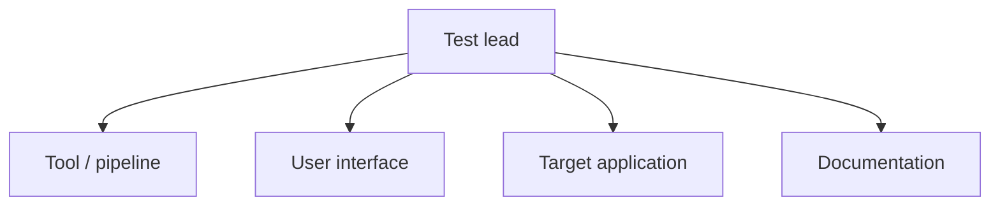

# Test Plan for the Mini-E-Commerce Backend

## Abstract

This document presents the master test plan for verifying a Django REST
e-commerce backend (henceforth referred to as the *system under test*,
SUT) using AutoTestDesign, an AI-assisted test design tool developed for
this project. The plan adopts the structure recommended by
ISO/IEC/IEEE 29119-3 and applies the foundation-level test process
defined by the ISTQB syllabus. It defines the scope of testing, the
functional and non-functional characteristics under evaluation, the
test suite organisation, the resources and schedule, and the entry and
exit criteria. Quantitative figures relating to performance and cost
are obtained from the benchmark instrumentation described in
[benchmark_report.md](benchmark_report.md) and are therefore
reproducible.

---

## 1. Introduction

Risk-based, technique-driven testing is widely recognised as more
effective than ad-hoc execution for revealing functional defects in
information systems [ISTQB 2018, ISO/IEC/IEEE 29119-1]. AutoTestDesign
operationalises this principle by combining a constrained large
language model for natural-language requirement structuring and risk
appraisal with deterministic rule engines for coverage-item
identification, test case generation, oracle synthesis, and suite
optimisation. The role of the present plan is to apply the tool to a
concrete target application and to document, in standardised form, the
test activities through which the resulting test suite is validated
against that target.

Throughout the document the term *target application* refers
exclusively to the Mini-E-Commerce backend; the AutoTestDesign tool
itself is a separate artefact whose internal verification is reported
in [test_design.md](test_design.md) and is not the subject of this
plan.

---

## 2. Scope

### 2.1 Context

The target application exposes a product catalogue and an order
workflow through a REST interface implemented with the Django REST
Framework. Twelve functional requirements (REQ-001 to REQ-012) are
catalogued in
[data/mini_ecommerce_requirements.json](../data/mini_ecommerce_requirements.json)
and form the unit of analysis for every activity in this plan.

The testing process follows a two-layer model. In *Layer A* the
AutoTestDesign tool produces structured, traceable test artefacts from
the requirements. In *Layer B* a PyTest harness executes those
artefacts against the running backend. This separation aligns with the
distinction between *test design* and *test execution* in
ISO/IEC/IEEE 29119-2 and is depicted in
[architecture.md](architecture.md) §1.

### 2.2 Objectives

1. To verify that the twelve catalogued requirements are satisfied by
   the implemented backend.
2. To concentrate test effort on requirements judged to be of higher
   product risk, in accordance with the risk register documented in
   [risk_analysis_report.md](risk_analysis_report.md).
3. To establish that the test artefacts produced by AutoTestDesign are
   directly executable against the target application without manual
   transcription.
4. To identify, repair, and re-verify any defects revealed by the
   designed suite, thereby providing evidence of an *evidence-based
   improvement* loop as required by the assignment.
5. To quantify the cost and performance of the approach using
   reproducible instrumentation
   ([benchmark_report.md](benchmark_report.md)).

### 2.3 Items in scope

The following are within the scope of the plan:

- All endpoints of the product subsystem (list, detail, create, update,
  delete).
- All endpoints of the order subsystem (create, retrieve, list, status
  update).
- The functional behaviour, input validation, and state-related side
  effects of those endpoints, including stock decrement, order status
  transitions, and total-price computation.
- The non-functional characteristics enumerated in §4.

### 2.4 Items out of scope

The following are explicitly excluded from this plan:

- The browser-based front-end of the e-commerce site.
- Production-scale load and stress testing.
- Authentication and authorisation mechanisms, which are absent from
  the reference backend and are addressed only as recommendations in
  [risk_analysis_report.md](risk_analysis_report.md) §7.
- Database migration and deployment.

### 2.5 Assumptions and constraints on the plan

The backend is assumed to run locally on `127.0.0.1:8000` during
execution. When the backend is not reachable, the integration suite
performs a graceful skip rather than a failure, which is verified in
§9. The large-language-model endpoint may be slow or unavailable; the
tool provides a deterministic rule fallback so that test design can
complete in either condition.

---

## 3. Test Items and Components

### 3.1 Functional features under test

The endpoints in Table 1 are exercised by the suite. The mapping to
requirements is bidirectional and is regenerated automatically into
[traceability_matrix.md](traceability_matrix.md).

**Table 1.** Endpoints and the requirements they realise.

| Subsystem | Endpoints | Requirements |
|---|---|---|
| Product management | `GET /api/products/`, `POST /api/products/create/`, `GET/PATCH/DELETE /api/products/<id>/` | REQ-001 – REQ-005 |
| Order creation | `POST /api/orders/create/` | REQ-006 – REQ-010 |
| Order retrieval | `GET /api/orders/`, `GET /api/orders/<id>/` | REQ-011 |
| Order status | `PATCH /api/orders/<id>/` | REQ-012 |

### 3.2 System architecture

The target application is a three-layer Django REST application.
Table 2 records the responsibility of each layer and the file in which
that responsibility is implemented.

**Table 2.** Layers of the system under test.

| Layer | File | Responsibility |
|---|---|---|
| URL dispatch | `store/urls.py` | Maps endpoints to view classes. |
| Views (controllers) | `store/views.py` | Business logic: input validation, stock manipulation, order assembly, total-price aggregation. |
| Persistence models | `store/models.py` | Entities `Product`, `Order`, `OrderItem` and the order status enumeration. |
| Serialisers | `store/serializers.py` | Conversion between Python objects and HTTP payloads. |

The order-creation view is identified as the architectural hot spot:
it performs multi-field validation, an existence check, a stock
boundary check, a stateful mutation, and a price aggregation in a
single request. The risk register accordingly classifies this region
as the highest-risk locus of the target application
([risk_analysis_report.md](risk_analysis_report.md) §3).

---

## 4. Non-Functional Requirements

Non-functional characteristics are evaluated according to four
attributes. For each attribute, a target value, a method of
verification, and the observed result are recorded.

### 4.1 Performance

**Target.** Generation of the test cases for one full requirement set
shall complete within two seconds.

**Method.** The instrument `scripts/benchmark.py` times the
deterministic generation pipeline (parse, structuring, risk analysis,
coverage analysis, test-case generation, oracle synthesis) over twenty
repeats and reports the arithmetic mean.

**Result.** The end-to-end generation latency averaged
*≈ 1 ms* for twelve requirements producing sixty-one test cases on
commodity hardware. The target is met by approximately three orders
of magnitude. Detailed per-stage figures are presented in
[benchmark_report.md](benchmark_report.md) §2. The large-language
model stages add network-bound latency that is reported in
[benchmark_report.md](benchmark_report.md) §3 but is not counted
against the generation budget, since they execute once per session and
fall back to the rule pipeline when unavailable.

### 4.2 Usability

The tool exposes the design process as a guided, single-direction
Streamlit pipeline. Each step unlocks only after its predecessor has
produced output; every long-running task displays a status block; and
every produced artefact is rendered in an editable table. This
arrangement enforces the order-of-operations expected by the test
process while preserving the interactive-review capability mandated by
the assignment.

### 4.3 Security

The reference backend implements no authentication mechanism. This
constraint is recorded as a known limitation rather than a defect of
the present plan. The risk register
([risk_analysis_report.md](risk_analysis_report.md) §7) identifies
destructive administrative actions (product deletion, REQ-005) and
order-detail exposure (REQ-011) as targets for an authorisation
hardening pass. Negative test cases assert that invalid inputs are
rejected with the appropriate 4xx response rather than silently
accepted. The large-language-model API key is held in `.env`, which is
excluded from version control.

### 4.4 Maintainability

Table 3 summarises the maintainability provisions adopted in the
project.

**Table 3.** Maintainability provisions.

| Provision | Realisation |
|---|---|
| Determinism | The non-LLM stages are pure rule engines; identical input produces identical output, ensuring reproducibility. |
| Separation of concerns | The user interface (`app.py`) is a thin scheduler over the modules in `core/`, each of which addresses a single concern. |
| Internal verification | Forty-eight unit tests cover the engines, optimiser, oracle, exporter, and state model. |
| Traceability | `scripts/build_traceability.py` regenerates the requirement-to-test matrix automatically. |
| Conventions | Terminology, identifiers, and JSON schemas are documented in [STYLE_GUIDE.md](STYLE_GUIDE.md). |

---

## 5. High-Level Test Suite Design

The suites are organised by subsystem; within each suite the choice of
technique is determined by the risk level of the requirement and by
the structural type of its constraints. The technique vocabulary is
that of ISO/IEC/IEEE 29119-4: *Equivalence Partitioning* (EP),
*Boundary Value Analysis* (BVA), *Decision Table Testing* (DT), and
*State Transition Testing* (ST).

**Table 4.** Suite-level design.

| Suite | Requirements | Risk level | Techniques applied | Rationale |
|---|---|---|---|---|
| Product CRUD | REQ-001 – REQ-005 | Low – High | EP, BVA, existence checks | Read endpoints are of low risk; creation, update, and deletion carry validation and irreversibility risk. |
| Order creation | REQ-006 – REQ-010 | High | EP, BVA, DT | Highest-risk workflow; boundary analysis on `quantity`, decision-table coverage on the combined create rules. |
| Order retrieval | REQ-011 | Low | EP (existence) | Single-identifier lookup, positive class plus 404 negative class. |
| Order status | REQ-012 | Medium | ST, enum boundary | Finite state machine; all-transitions and guard coverage applied. |

Technique selection follows [coverage_strategy.md](coverage_strategy.md)
and [test_design.md](test_design.md). The risk-to-depth mapping
concentrates the deepest coverage on the order workflow, which is the
locus identified by the risk register as carrying the greatest
business impact.

---

## 6. Test Levels and Schedule

### 6.1 Test levels

Three test levels are distinguished in accordance with the ISTQB
foundation-level taxonomy.

**Table 5.** Test levels.

| Level | Object of verification | Location |
|---|---|---|
| Unit | Internal engines of the tool | `tests/unit/` |
| Integration | Tool-produced artefacts executed against the live backend | `tests/integration/test_data_driven_orders.py` |
| System | End-to-end backend behaviour, hand-written | `tests/integration/test_mini_ecommerce_api.py`, `test_order_api.py`, `test_order_status_api.py` |

### 6.2 Milestones

**Table 6.** Project milestones.

| Phase | Activity | Status |
|---|---|---|
| Planning | Scope definition, risk ranking, framework selection | Completed |
| Analysis and design | Requirement parsing, coverage-item identification, test-case generation | Completed |
| Implementation | Construction of the PyTest harness and data-driven adapter | Completed |
| Execution | Execution of all suites against the backend | Completed |
| Defect handling | Detection, repair, and re-verification of the defects reported in [test_result_analysis.md](test_result_analysis.md) | Completed |
| Completion | Reporting, traceability, packaging | In progress |

---

## 7. Organisation

The roles set out in Table 7 cover all activities of the test process.
In a single-maintainer configuration these roles are performed in
sequence by one person; the table records the responsibility split that
the work follows regardless of headcount.

**Table 7.** Roles and responsibilities.

| Role | Member | Responsibilities |
|---|---|---|
| Test lead | _<name, student ID>_ | Plan ownership, risk sign-off, scheduling. |
| Tool / pipeline | _<name, student ID>_ | Parsing, risk analysis, coverage, test-design engines. |
| User interface | _<name, student ID>_ | Streamlit workflow, export, in-UI test runner. |
| Target application | _<name, student ID>_ | Backend, PyTest harness, defect repair and re-test. |
| Documentation | _<name, student ID>_ | Reports, traceability, style consistency, packaging. |

---

## 8. Test Framework and Rationale

**Table 8.** Frameworks selected.

| Framework | Used for | Rationale |
|---|---|---|
| PyTest | Test execution | The de facto standard for Python; `parametrize` supports the data-driven harness; reports are readable; fixtures are expressive. |
| `requests` | Issuing HTTP calls to the backend | Simple and explicit; mirrors the behaviour of a real client. |
| Django REST Framework | The SUT itself | The framework chosen by the target application. |
| Streamlit | The tool's user interface | Rapid construction of interactive, editable tables for human-in-the-loop review. |

Selenium was considered for end-to-end browser testing and rejected on
the grounds that the target is a REST backend without a browser
interface; HTTP-level testing using `requests` and PyTest is more
direct, faster, and free of the flakiness commonly associated with
browser automation. JUnit was considered and rejected as inapplicable
to a Python/Django stack. Should a front-end be added in a subsequent
iteration, the suitability of Selenium would be reassessed for that
layer in isolation.

---

## 9. Cost

A complete cost analysis — including person-hour estimates, measured
LLM token cost, and a break-even comparison with manual test design —
is presented in [cost_estimation.md](cost_estimation.md). All token
figures are obtained from
[benchmark_report.md](benchmark_report.md). In summary, the tool
front-loads effort into the construction of the pipeline; thereafter
the marginal per-project cost of designing and executing a suite
approaches zero, with the LLM cost per full run measured at
approximately ¥0.20 at list price.

---

## 10. Entry and Exit Criteria

**Table 9.** Entry and exit criteria.

| Gate | Criteria |
|---|---|
| Entry | The backend executes locally; requirements are catalogued; the tool pipeline passes the unit suite. |
| Exit | All twelve requirements are covered; the offline suite passes without failure; the full suite passes with the backend running; every identified defect is repaired and re-verified; performance and cost are measured. |

The exit criteria are satisfied at the time of writing. The offline
suite reports forty-eight passing tests and eighty-one skipped
tests; with the backend running, the full suite reports one hundred
twenty-nine passing tests, excluding two LLM smoke tests that require
live API access. Three defects (the lower-quantity input guard, the
non-atomic multi-item order, and the missing order-status transition
guard) were detected, repaired, and re-verified under the procedure
described in [test_result_analysis.md](test_result_analysis.md).
Generation latency was measured at approximately one millisecond, well
below the two-second target ([benchmark_report.md](benchmark_report.md)
§1).

---

## 11. Generalisability

Although the present plan addresses the Mini-E-Commerce backend, no
element of the design is specific to e-commerce. Targeting a different
application requires the supply of (a) a requirement set in plain text
or in the schema-v1 JSON form and (b) a request-template adapter
analogous to
[tests/integration/mec_request_builder.py](../tests/integration/mec_request_builder.py)
that maps coverage types to HTTP calls. The parsing, risk analysis,
coverage, test-case, oracle, and optimisation stages are
domain-agnostic; they operate on the nine constraint types catalogued
in [constraint_schema.md](constraint_schema.md). The plan structure
itself is reusable subject to substitution of the items in §3 and the
risk register in §5.

---

## References

- IEEE Standards Association, *IEEE 829-2008: Standard for Software and System Test Documentation*.
- ISO/IEC/IEEE 29119-1:2022, *Software and systems engineering — Software testing — Part 1: General concepts*.
- ISO/IEC/IEEE 29119-2:2021, *Part 2: Test processes*.
- ISO/IEC/IEEE 29119-3:2021, *Part 3: Test documentation*.
- ISO/IEC/IEEE 29119-4:2021, *Part 4: Test techniques*.
- International Software Testing Qualifications Board (ISTQB), *Foundation Level Syllabus*, 2018.
