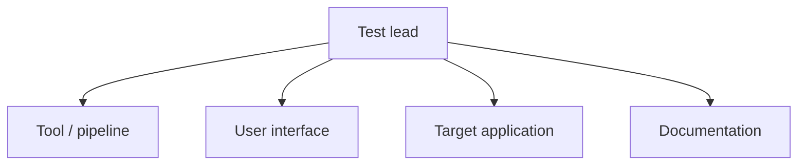

# Test Plan — Mini-E-Commerce Backend

> **Subject:** the **target application** — a Django REST Mini-E-Commerce
> backend — tested *using* the AutoTestDesign tool. The tool's own internal
> verification is reported separately in [test_design.md](test_design.md)
> and is not the subject of this plan.
> **Relationship to the tool:** this hand-authored plan is the gold
> reference; AutoTestDesign emits an equivalent IEEE 829 plan per run into
> `outputs/run_<timestamp>/docs/test_plan.md`, populated from that run's
> data and with tool-measured generation cost injected into §10.2.

## Abstract

This document is the master test plan for verifying the target application
using AutoTestDesign, an AI-assisted test-design tool. The plan adopts the
IEEE 829-2008 Test Plan structure and applies the foundation-level test
process of the ISTQB syllabus. It defines the scope and objectives of
testing, the items and components under test, the suite organisation and
technique selection, the resources, schedule and cost, and the entry/exit
criteria. Quantitative performance and cost figures are obtained from the
benchmark instrumentation ([benchmark_report.md](benchmark_report.md)) and
from the tool's own per-run timing, and are therefore reproducible.

The mapping from the seven assignment-required test-plan aspects, and from
the five assessment criteria, to the IEEE 829 sections below is given in
Appendix A.

---

## 1. Test plan identifier

| Field | Value |
|---|---|
| Plan | Master Test Plan — Mini-E-Commerce Backend |
| Version | 2.0 (IEEE 829-2008 aligned) |
| Target application | Django REST Mini-E-Commerce backend |
| Tool used to test it | AutoTestDesign (this project) |
| Standards | IEEE 829-2008; ISO/IEC/IEEE 29119-1..4; ISTQB FL 2018 |
| Companion documents | [risk_analysis_report.md](risk_analysis_report.md), [detailed_test_design_execution.md](detailed_test_design_execution.md), [test_result_analysis.md](test_result_analysis.md), [cost_estimation.md](cost_estimation.md), [benchmark_report.md](benchmark_report.md) |

---

## 2. Introduction (project scope)

### 2.1 Background

The target application exposes a product catalogue and an order workflow
through a REST interface implemented with the Django REST Framework. Twelve
functional requirements (REQ-001 … REQ-012) are catalogued in
[data/mini_ecommerce_requirements.json](../data/mini_ecommerce_requirements.json)
and form the unit of analysis for every activity in this plan.

The testing process follows a **two-layer model**, aligned with the
*test design* / *test execution* distinction of ISO/IEC/IEEE 29119-2:

- **Layer A — design.** AutoTestDesign parses the requirements, scores their
  risk, derives coverage items, generates black-box and white-box test
  cases with synthesised oracles, and optimises the suite.
- **Layer B — execution.** A PyTest harness executes those artefacts against
  the running backend and produces a per-case pass/fail report.

### 2.2 Overall objectives

1. Verify that the twelve catalogued requirements are satisfied by the
   implemented backend.
2. Concentrate test effort on higher-risk requirements per the
   [risk analysis report](risk_analysis_report.md).
3. Establish that the tool-produced artefacts are directly executable
   against the target without manual transcription.
4. Detect, repair, and re-verify any defects the designed suite reveals —
   an evidence-based improvement loop ([test_result_analysis.md](test_result_analysis.md)).
5. Quantify the cost and performance of the approach with reproducible
   instrumentation (§10.2, [benchmark_report.md](benchmark_report.md)).

---

## 3. Test items

The items under test are the endpoints of the target application and the
components that implement them.

**Table 1.** Endpoints and the requirements they realise.

| Subsystem | Endpoints | Requirements |
|---|---|---|
| Product management | `GET /api/products/`, `POST /api/products/create/`, `GET/PATCH/DELETE /api/products/<id>/` | REQ-001 – REQ-005 |
| Order creation | `POST /api/orders/create/` | REQ-006 – REQ-010 |
| Order retrieval | `GET /api/orders/`, `GET /api/orders/<id>/` | REQ-011 |
| Order status | `PATCH /api/orders/<id>/` | REQ-012 |

**Table 2.** System architecture (components of the SUT).

| Layer | File | Responsibility |
|---|---|---|
| URL dispatch | `store/urls.py` | Maps endpoints to view classes. |
| Views (controllers) | `store/views.py` | Validation, stock manipulation, order assembly, total-price aggregation. |
| Persistence models | `store/models.py` | Entities `Product`, `Order`, `OrderItem` and the order-status enumeration. |
| Serialisers | `store/serializers.py` | Conversion between Python objects and HTTP payloads. |

The order-creation view is the architectural hot spot: it performs
multi-field validation, an existence check, a stock boundary check, a
stateful mutation, and a price aggregation in a single request. The risk
register accordingly classifies this region as the highest-risk locus
([risk_analysis_report.md](risk_analysis_report.md) §6).

---

## 4. Features to be tested

### 4.1 Functional features

All endpoints of the product subsystem (list, detail, create, update,
delete) and the order subsystem (create, retrieve, list, status update),
including input validation and state-related side effects: stock decrement,
order-status transitions, and total-price computation.

### 4.2 Non-functional characteristics

For each attribute, a target, a verification method, and the observed result
are recorded.

**Table 3.** Non-functional requirements.

| Attribute | Target | Method | Result |
|---|---|---|---|
| Performance | Generation of one full requirement set < 2 s | `scripts/benchmark.py` times the deterministic pipeline over 20 repeats | ≈ 1 ms (rule path); target met by ~3 orders of magnitude ([benchmark_report.md](benchmark_report.md) §2). LLM stages add network latency, reported in §3, excluded from the generation budget. |
| Usability | Guided, single-direction workflow with interactive review | Inspection of the Streamlit pipeline | Each step unlocks only after its predecessor; every artefact is rendered in an editable table. |
| Security | Invalid inputs rejected with 4xx; secrets excluded from VCS | Negative test cases; repository inspection | Negative cases assert 4xx; the API key is held in `.env` and git-ignored. Auth is a known gap (§4.3). |
| Maintainability | Deterministic engines; automated traceability | Unit suite; `scripts/build_traceability.py` | 47 unit tests over the engines/optimiser/oracle/exporter/state model; the matrix regenerates automatically. |

### 4.3 Note on security scope

The reference backend implements no authentication. This is recorded as a
known limitation, not a defect of this plan; the
[risk analysis report](risk_analysis_report.md) §10 prescribes auth
hardening for destructive admin actions (REQ-005) and order-detail exposure
(REQ-011) in future iterations.

---

## 5. Features not to be tested

- The browser-based front-end of the e-commerce site (no requirement
  covers it).
- Production-scale load and stress testing.
- Authentication and authorisation mechanisms (absent from the reference
  backend; addressed only as recommendations).
- Database migration and deployment.

---

## 6. Approach (high-level test suite design)

Suites are organised by subsystem; within each suite the technique is
selected from the risk level of the requirement and the structural type of
its constraints. The technique vocabulary is that of ISO/IEC/IEEE 29119-4:
Equivalence Partitioning (EP), Boundary Value Analysis (BVA), Decision Table
Testing (DT), and State Transition Testing (ST).

**Table 4.** Suite-level design (selection driven by requirements + risk).

| Suite | Requirements | Risk level | Techniques applied | Rationale |
|---|---|---|---|---|
| Product CRUD | REQ-001 – REQ-005 | Low – High | EP, BVA, existence checks | Read endpoints are low risk; create/update/delete carry validation and irreversibility risk. |
| Order creation | REQ-006 – REQ-010 | Medium – High | EP, BVA, DT | Highest-impact workflow; boundary analysis on `quantity`, decision-table coverage on the combined create rules. |
| Order retrieval | REQ-011 | Low | EP (existence) | Single-identifier lookup; positive class plus 404 negative class. |
| Order status | REQ-012 | Medium | ST, enum boundary | Finite state machine; all-transitions and invalid-guard coverage. |

Technique selection follows [coverage_strategy.md](coverage_strategy.md)
and [test_design.md](test_design.md). The risk-to-depth mapping
([risk_analysis_report.md](risk_analysis_report.md) §8) concentrates the
deepest coverage on the order workflow. The full design and execution of the
highest-risk module is documented in
[detailed_test_design_execution.md](detailed_test_design_execution.md).

---

## 7. Item pass/fail criteria

A test item **passes** when the observed HTTP status and payload match the
oracle synthesised for the case (the expected status class and any
`must_contain` assertions). It **fails** when they diverge. State-related
cases additionally assert the post-condition (e.g. stock decremented by
exactly the ordered quantity, or unchanged after a 4xx). A requirement is
considered covered when every coverage item identified for it is realised by
at least one executable case.

---

## 8. Suspension and resumption criteria

Execution is **suspended** if the backend is unreachable (the harness then
performs a graceful skip rather than a failure, verified in §10.1) or if the
tool's unit suite is red. It **resumes** once the backend responds on the
configured URL and the unit suite is green. The LLM endpoint may be slow or
unavailable; the tool's deterministic rule fallback allows test design to
complete in either condition, so LLM availability never suspends the plan.

---

## 9. Test deliverables

- Structured requirements, risk register, coverage items, and test cases as
  CSV / JSON / a multi-sheet Excel workbook (per run, in
  `outputs/run_<ts>/data/`).
- The three IEEE 829 reports (this plan, the risk analysis report, the
  detailed test design & execution) in `outputs/run_<ts>/docs/`.
- The project-wide [traceability_matrix.md](traceability_matrix.md).
- The per-execution test-case payloads handed to PyTest
  (`outputs/run_<ts>/runs/`).

---

## 10. Testing tasks, schedule and cost

### 10.1 Test levels and schedule

**Table 5.** Test levels (ISTQB taxonomy).

| Level | Object of verification | Location |
|---|---|---|
| Unit | Internal engines of the tool | `tests/unit/` |
| Integration | Tool-produced artefacts executed against the live backend | `tests/integration/test_data_driven_orders.py` |
| System | End-to-end backend behaviour (hand-written) | `tests/integration/test_mini_ecommerce_api.py`, `test_order_api.py`, `test_order_status_api.py` |

**Table 6.** Phase checklist.

| Phase | Activity | Status |
|---|---|---|
| Planning | Scope, risk ranking, framework selection | ☑ |
| Analysis & design | Requirement parsing, coverage-item identification, test-case generation | ☑ |
| Implementation | PyTest harness and data-driven adapter | ☑ |
| Execution | Execution of all suites against the backend | ☑ |
| Defect handling | Detection, repair, re-verification ([test_result_analysis.md](test_result_analysis.md)) | ☑ |
| Completion | Reporting, traceability, packaging | ☐ (in progress) |

### 10.2 Cost estimation

A complete analysis — person-hour estimates, measured LLM token cost, and a
break-even comparison with manual test design — is in
[cost_estimation.md](cost_estimation.md). Two cost bases are distinguished,
both measured rather than asserted:

1. **Design-phase pipeline cost.** The tool times every design step
   (parse, risk, coverage, test-case generation, optimisation) wall-clock
   and records it per run; the rule path totals ≈ 1 ms, the LLM path adds
   network-bound latency. These per-stage figures appear in the generated
   plan's cost table.
2. **Document-generation cost.** When the LLM writes the deliverables, the
   tool measures each document's generation time and token usage
   (`response.usage`) and injects a metrics table plus a ¥ token-cost line
   into this section of the *generated* plan. A representative full run
   measured ≈ 20.8k tokens (≈ ¥0.017 at list price) to produce all three
   documents.

In summary, the tool front-loads effort into building the pipeline;
thereafter the marginal per-project cost of designing and executing a suite
approaches zero. Manual design and scripting of the equivalent suite is
estimated at an order of magnitude more person-hours
([cost_estimation.md](cost_estimation.md)).

---

## 11. Environmental needs and chosen testing framework

The backend runs locally on `127.0.0.1:8000` (configurable in the sidebar)
during execution.

**Table 7.** Frameworks selected, with rationale.

| Framework | Used for | Rationale |
|---|---|---|
| PyTest | Test execution | The de-facto Python standard; `parametrize` drives the data-driven harness; reports are readable; fixtures are expressive. |
| `requests` | Issuing HTTP calls to the backend | Simple and explicit; mirrors a real REST client. |
| Django REST Framework | The system under test | The framework the target application is built on. |
| Streamlit | The tool's user interface | Rapid interactive, editable tables for human-in-the-loop review. |

**Rationale for rejecting alternatives.** Selenium was considered for
end-to-end browser testing and rejected: the target is a REST backend with
no browser interface, so HTTP-level testing with `requests`+PyTest is more
direct, faster, and free of browser-automation flakiness. JUnit was rejected
as inapplicable to a Python/Django stack. Should a front-end be added later,
Selenium would be reassessed for that layer in isolation.

---

## 12. Responsibilities and staffing (organisation chart)

The roles below cover all activities of the test process. In a
single-maintainer configuration they are performed in sequence by one
person; the table records the responsibility split the work follows
regardless of headcount.

**Table 8.** Roles and responsibilities for the testing activity (using the
AutoTestDesign tool).

| Role | Responsibilities |
|---|---|
| Test lead | Plan ownership, risk sign-off, scheduling. |
| Tool / pipeline | Parsing, risk analysis, coverage, test-design engines. |
| User interface | Streamlit workflow, export, in-UI test runner. |
| Target application | Backend, PyTest harness, defect repair and re-test. |
| Documentation | Reports, traceability, style consistency, packaging. |

Staffing and training needs are minimal: the tool's guided workflow means a
tester needs only familiarity with REST concepts and the ISTQB technique
vocabulary; no bespoke training is required to operate the pipeline.

---

## 13. Risks and contingencies

Product risk for the target application is detailed in the
[risk analysis report](risk_analysis_report.md). The High-risk requirements
requiring the deepest coverage are **REQ-004, REQ-006, REQ-010**.
Project-level contingencies: if the LLM endpoint is unavailable, the
deterministic fallback preserves design throughput; if the backend is down,
the integration suite skips gracefully; if a generated artefact is judged
wrong, the designer edits it in-UI and downstream stages regenerate.

---

## 14. Entry/exit criteria and approvals

**Table 9.** Entry and exit criteria.

| Gate | Criteria |
|---|---|
| Entry | The backend executes locally; requirements are catalogued; the tool pipeline passes the unit suite. |
| Exit | All twelve requirements are covered; the offline suite passes; the full suite passes with the backend running; every identified defect is repaired and re-verified; performance and cost are measured. |

At the time of writing the exit criteria are satisfied: the offline suite
reports 48 passing / 81 skipped tests; with the backend running the full
suite reports 129 passing tests (excluding two LLM smoke tests needing live
API access); three defects were detected, repaired and re-verified
([test_result_analysis.md](test_result_analysis.md)); and generation latency
was measured at ≈ 1 ms, well below the 2 s target.

---

## 15. Generalisability

No element of the design is specific to e-commerce. Targeting a different
application requires only (a) a requirement set in plain text or schema-v1
JSON and (b) a request-template adapter analogous to
[tests/integration/mec_request_builder.py](../tests/integration/mec_request_builder.py)
mapping coverage types to HTTP calls. The parsing, risk, coverage,
test-case, oracle, and optimisation stages are domain-agnostic, operating on
the nine constraint types of [constraint_schema.md](constraint_schema.md).
The plan structure itself is reusable subject to substitution of the items
in §3 and the suite design in §6.

---

## References

- IEEE 829-2008, *IEEE Standard for Software and System Test Documentation*.
- ISO/IEC/IEEE 29119-1:2022 … -4:2021, *Software testing* Parts 1–4.
- International Software Testing Qualifications Board (ISTQB), *Foundation Level Syllabus*, 2018.
