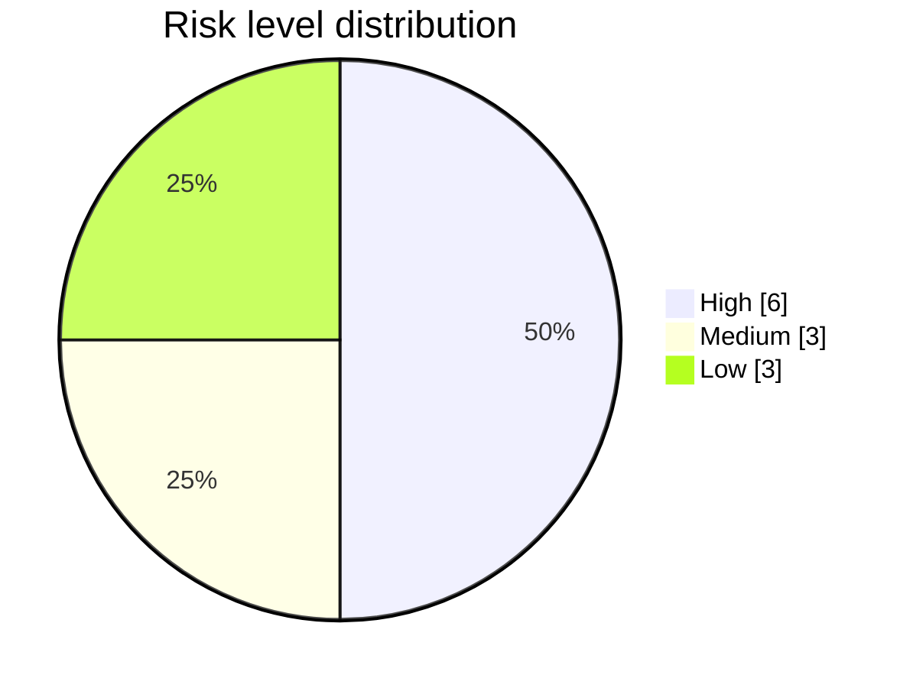

> _Auto-generated by **AutoTestDesign** (LLM: `qwen3.6-flash`) for run `run_20260602_162619` on 2026-06-02 16:32:37._
> _Target application: **Mini-E-Commerce Backend (Django REST)**._

# Risk Analysis Report — Mini-E-Commerce Backend (Django REST)

## 1. Report identifier
Run run_20260602_162619 — Risk Analysis for Mini-E-Commerce Backend (Django REST)

## 2. Introduction
The purpose of this report is to establish a risk-based testing strategy aligned with ISTQB guidelines and ISO/IEC/IEEE 29119-1 standards. The scope encompasses twelve defined requirements spanning Product Management and Order Processing modules. Risk levels derived from this analysis directly drive downstream test coverage depth, ensuring that testing effort is proportionally allocated to the most critical system behaviors.

## 3. Risk assessment method
Each requirement is rated 1-3 on four dimensions (business_impact, failure_probability, complexity, failure_impact). The four ratings are summed (4-12) and linearly rescaled to a 1-10 risk_score, mapped to a level: 1-3 Low, 4-7 Medium, 8-10 High.

## 4. Risk register
| Requirement | Feature | Level | Score |
|---|---|---|---:|
| REQ-007 | Validate order items | High | 9 |
| REQ-009 | Validate stock availability | High | 9 |
| REQ-006 | Create order | High | 8 |
| REQ-008 | Validate customer information | High | 8 |
| REQ-010 | Deduct stock on order completion | High | 8 |
| REQ-012 | Update order status | High | 8 |
| REQ-004 | Update existing product | Medium | 7 |
| REQ-005 | Delete product | Medium | 7 |
| REQ-003 | Create new product | Medium | 6 |
| REQ-001 | Display product catalog | Low | 2 |
| REQ-002 | View product details | Low | 2 |
| REQ-011 | View order details | Low | 2 |

## 5. Risk distribution
| Level | Count | Requirements |
|---|---|---|
| High | 6 | REQ-006, REQ-007, REQ-008, REQ-009, REQ-010, REQ-012 |
| Medium | 3 | REQ-003, REQ-004, REQ-005 |
| Low | 3 | REQ-001, REQ-002, REQ-011 |

## 6. High-risk items

### REQ-006: Create order
- **Dimension Ratings:** business_impact 3, failure_probability 2, complexity 2, failure_impact 3
- **Risk Reason:** business_impact high: order acceptance is a core revenue-generating transaction that directly drives business operations; failure_probability medium: stateful database writes and uniqueness constraints create moderate opportunities for race conditions or silent failures; complexity medium: requires input validation, sequence generation, and atomic persistence without excessive branching logic; failure_impact high: duplicate IDs or failed acceptance cause lost sales, inventory desynchronization, and customer trust erosion
- **Test Focus:** Prioritize atomic persistence verification, uniqueness constraint enforcement, and concurrent submission testing to prevent duplicate orders and inventory desynchronization.

### REQ-007: Validate order items
- **Dimension Ratings:** business_impact 3, failure_probability 3, complexity 2, failure_impact 3
- **Risk Reason:** business_impact high: order processing is core to revenue and fulfillment, making accurate execution essential to the business; failure_probability high: input-validation guards are precisely where edge-case defects hide, increasing the likelihood of undetected logic flaws; complexity medium: requires evaluating multiple field constraints and conditional branches without deeply nested state or external dependencies; failure_impact high: bypassing validation allows invalid orders through, risking financial loss, inventory corruption, and customer disputes
- **Test Focus:** Execute exhaustive boundary and negative testing against all input-validation guards to ensure invalid order items cannot bypass processing checks.

### REQ-008: Validate customer information
- **Dimension Ratings:** business_impact 3, failure_probability 2, complexity 2, failure_impact 3
- **Risk Reason:** business_impact high: core transactional workflow essential for revenue capture and order fulfillment; failure_probability medium: validation guards evaluate multiple input fields and business rules where defects frequently emerge; complexity medium: requires cross-checking formats, availability, pricing logic, and potential external service responses; failure_impact high: silent acceptance of invalid data or false rejections causes financial loss, inventory drift, and customer churn
- **Test Focus:** Validate cross-field format checks, availability rules, and pricing logic against malformed or malicious payloads to prevent silent data acceptance or false rejections.

### REQ-009: Validate stock availability
- **Dimension Ratings:** business_impact 3, failure_probability 3, complexity 2, failure_impact 3
- **Risk Reason:** business_impact high: order processing is a core revenue-generating workflow where accurate stock enforcement is essential to business operations; failure_probability high: stateful stock validation under concurrent requests is prone to race conditions and edge cases where defects commonly hide; complexity medium: requires querying real-time inventory, evaluating thresholds, and routing specific error responses without deep branching logic; failure_impact high: allowing oversells causes lost revenue, customer dissatisfaction, and inventory data corruption which are severe operational failures
- **Test Focus:** Stress-test concurrent inventory queries and threshold evaluations to eliminate race conditions and prevent overselling scenarios.

### REQ-010: Deduct stock on order completion
- **Dimension Ratings:** business_impact 3, failure_probability 2, complexity 2, failure_impact 3
- **Risk Reason:** business_impact high: stock reduction is a core transactional operation directly tied to revenue fulfillment and inventory accuracy; failure_probability medium: concurrent updates and network timeouts create race conditions where defects may evade basic testing; complexity medium: requires precise arithmetic, atomic database transactions, and proper error handling for partial failures; failure_impact high: incorrect stock levels cause overselling, inventory drift, and direct financial/customer trust losses
- **Test Focus:** Verify atomic database transactions, precise arithmetic, and robust error handling for partial failures under simulated network timeouts.

### REQ-012: Update order status
- **Dimension Ratings:** business_impact 3, failure_probability 2, complexity 2, failure_impact 3
- **Risk Reason:** business_impact high: order processing is a core revenue-critical workflow essential to fulfilling customer purchases; failure_probability medium: state transitions and database updates introduce moderate defect risk, particularly around concurrency and idempotency; complexity medium: requires coordinating persistent state changes, validation checks, and reliable response generation without excessive branching; failure_impact high: incorrect status updates or failed confirmations directly cause lost sales, inventory desynchronization, and customer trust erosion
- **Test Focus:** Ensure idempotent state transitions and reliable response generation across all valid and invalid status change paths to prevent sales loss and inventory drift.

## 7. Risk-to-coverage strategy
Coverage depth is dictated by the assigned risk level. High-risk requirements retain every identified test case and strongly favour boundary, negative, and decision-table techniques to expose edge-case and logic flaws. Medium-risk requirements keep one representative test per coverage type alongside all decision-table cases. Low-risk requirements deduplicate by coverage type, retaining at least one representative test per category to maintain baseline verification while conserving execution effort.

## 8. Mitigation recommendations
| Dimension Driver | Recommendation |
|---|---|
| business_impact / failure_impact (rated 3 across all High items) | Implement comprehensive transactional rollback mechanisms and immutable audit logging for all Order Processing endpoints to contain financial loss and inventory corruption upon failure. |
| failure_probability (rated 2–3 across all High items) | Integrate automated concurrency testing and race-condition detection into the CI pipeline to surface defects in validation guards, stock updates, and state mutations before integration. |
| complexity (rated 2 across all High items) | Enforce strict input validation schemas and decision-table coverage matrices for all order and stock workflows to systematically eliminate defect-hiding zones and reduce branching ambiguity. |

## 9. Limitations
The risk ratings and scores presented herein are model-derived and reproducible given identical inputs. They serve as a structured baseline for test planning and may be overridden by the lead tester or quality engineer after manual review, prior to the formal design of the test suite.
