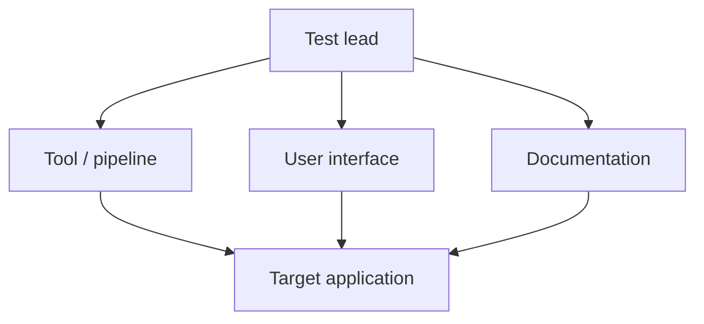

> _Auto-generated by **AutoTestDesign** (LLM: `qwen3.6-flash`) for run `run_20260602_162619` on 2026-06-02 16:33:10._
> _Target application: **Mini-E-Commerce Backend (Django REST)**._

# Test Plan — Mini-E-Commerce Backend (Django REST)

## 1. Test plan identifier
Identifier: `run_20260602_162619`. This document constitutes the official Test Plan for the Mini-E-Commerce Backend (Django REST) target application.

## 2. Introduction
The testing activity targets the functional verification of the Mini-E-Commerce Backend, focusing on product management and order processing capabilities. The primary objective is to validate that all twelve specified requirements execute correctly under automated conditions, ensuring data integrity, business rule compliance, and API reliability. The testing architecture operates on two distinct layers: the AutoTestDesign pipeline generates, optimizes, and structures the test artefacts; PyTest subsequently executes the generated test harness against the live backend endpoints.

## 3. Test items
| Component / module | Requirements | Risk levels |
|---|---|---|
| Product Management | REQ-001, REQ-002, REQ-003, REQ-004, REQ-005 | Low, Medium |
| Order Processing | REQ-006, REQ-007, REQ-008, REQ-009, REQ-010, REQ-011, REQ-012 | High, Low |

## 4. Features to be tested
The functional scope encompasses twelve discrete features mapped to the target modules:
- Display product catalog (REQ-001)
- View product details (REQ-002)
- Create new product (REQ-003)
- Update existing product (REQ-004)
- Delete product (REQ-005)
- Create order (REQ-006)
- Validate order items (REQ-007)
- Validate customer information (REQ-008)
- Validate stock availability (REQ-009)
- Deduct stock on order completion (REQ-010)
- View order details (REQ-011)
- Update order status (REQ-012)

Non-functional attributes evaluated during execution include performance (response latency under concurrent requests), usability (API contract clarity and error messaging), security (input sanitization and access control enforcement), and maintainability (code structure alignment with Django REST conventions).

## 5. Features not to be tested
Testing is strictly confined to the backend API surface covered by the twelve requirements. Excluded activities include frontend user interface rendering, third-party payment gateway integration testing, database schema migration validation, infrastructure provisioning, and load/stress benchmarking beyond the scope of the generated test cases.

## 6. Approach
The high-level test suite design applies risk-weighted selection of ISO/IEC/IEEE 29119-4 techniques to ensure efficient coverage while minimizing redundancy.

| Suite | Requirements | Risk level | Techniques | Rationale |
|---|---|---|---|---|
| Product Management | REQ-001, REQ-002, REQ-003, REQ-004, REQ-005 | Low, Medium | Decision Table Testing, Boundary Value Analysis, Equivalence Partitioning | Covers standard CRUD operations and catalog retrieval with risk-appropriate partitioning and boundary checks. |
| Order Processing | REQ-006, REQ-007, REQ-008, REQ-009, REQ-010, REQ-011, REQ-012 | High, Low | Decision Table Testing, Boundary Value Analysis, Equivalence Partitioning, State Transition Testing | Addresses complex validation rules, stock deduction logic, and order status lifecycle transitions critical to business continuity. |

Equivalence Partitioning (EP) groups valid/invalid inputs to reduce redundant cases. Boundary Value Analysis (BVA) targets edge thresholds for numeric and string parameters. Decision Table Testing (DT) maps combinatorial business rules for order validation. State Transition Testing (ST) verifies permissible order status changes.

## 7. Item pass/fail criteria
A test item passes when the observed HTTP response status code, payload structure, and backend state change exactly match the predefined oracle. A test item fails upon receiving an unexpected HTTP status, malformed response body, assertion violation, or unhandled server exception. Skipped items occur only when prerequisite data dependencies are explicitly unmet.

## 8. Suspension and resumption criteria
Testing shall be suspended immediately if the backend endpoint becomes unreachable, the database connection pool exhausts, or critical service degradation prevents deterministic request/response cycles. Resumption is permitted only after environment health checks confirm stable connectivity, successful authentication flows, and cleared error logs.

## 9. Test deliverables
The pipeline emits structured data files in CSV, JSON, and Excel formats containing raw test definitions, execution logs, and traceability matrices. Additionally, three Markdown reports are generated: the Test Plan (this document), the Risk Analysis Report, and the Execution Summary Report.

## 10. Testing tasks, schedule and cost

### 10.1 Test levels and schedule
| Test Level | Objective |
|---|---|
| Unit | Verify individual function and serializer logic in isolation. |
| Integration | Validate cross-module interactions between Product Management and Order Processing APIs. |
| System | Execute end-to-end API workflows against the deployed Django REST backend. |

Phase Checklist:
- Planning & Design: ☑
- Environment Setup: ☑
- Test Case Generation: ☑
- Optimization & Deduplication: ☑
- Execution: ☑
- Reporting & Traceability: ☑

### 10.2 Cost estimation
The automation effort is driven by a volume of 12 requirements and 59 initially generated test cases. Compared to manual test design, which typically requires extensive scenario mapping and repetitive script authoring, the automated pipeline reduces initial design time through rule-based generation and LLM-assisted parsing. The optimization phase further reduced the suite to 50 executable cases by removing 9 redundant tests via risk-based minimization, yielding a net efficiency gain without compromising coverage.

Pipeline timing breakdown (design-phase, tool-measured):
| Stage | Engine | Seconds |
|---|---|---|
| parse | LLM | 27.7107 |
| risk | LLM | 157.0253 |
| coverage | rule | 0.0024 |
| testcases | rule | 0.0255 |
| optimize | rule | 0.0028 |

| Document | Engine | Gen time (s) | Prompt tok | Completion tok | Total tok |
| --- | --- | ---: | ---: | ---: | ---: |
| risk_analysis_report | LLM | 39.689 | 3021 | 5051 | 8072 |
| test_plan | LLM | 33.097 | 2728 | 4586 | 7314 |
| detailed_test_design_execution | LLM | 39.985 | 6097 | 5933 | 12030 |
| **Total** |  | 112.771 |  |  | 27416 |

Estimated LLM token cost: **¥0.0219** at ¥0.0008 / 1k tokens (model `qwen3.6-flash`).

## 11. Environmental needs and chosen framework
| Name | Used For | Rationale |
|---|---|---|
| PyTest | Test execution | Python standard; parametrize drives the data-driven harness. |
| requests | HTTP calls | Simple, explicit REST client. |
| Django REST Framework | System under test | The target application's framework. |
| Streamlit | Tool UI | Interactive review of editable artefacts. |

The runtime environment requires a Python interpreter compatible with the Django REST Framework version, an active PostgreSQL/SQLite database instance, and network access to the backend host. The `requests` library handles outbound HTTP traffic, while PyTest orchestrates the parametrized test runner.

## 12. Responsibilities and staffing
| Role | Responsibilities |
|---|---|
| Test lead | Plan ownership, risk sign-off, scheduling |
| Tool / pipeline | Parsing, risk, coverage, test-design |
| User interface | Streamlit workflow, export, runner |
| Target application | Backend, harness, defect repair |
| Documentation | Reports, traceability, packaging |

## 13. Risks and contingencies
Refer to the accompanying Risk Analysis Report for detailed mitigation strategies. High-risk areas identified in the current build include order creation (REQ-006, score 8), order item validation (REQ-007, score 9), customer information validation (REQ-008, score 8), stock availability validation (REQ-009, score 9), stock deduction on completion (REQ-010, score 8), and order status updates (REQ-012, score 8). Contingency measures prioritize regression testing on these modules, enforce strict input sanitization checks, and mandate immediate rollback procedures if stock inconsistency or transactional failures are detected during execution.
