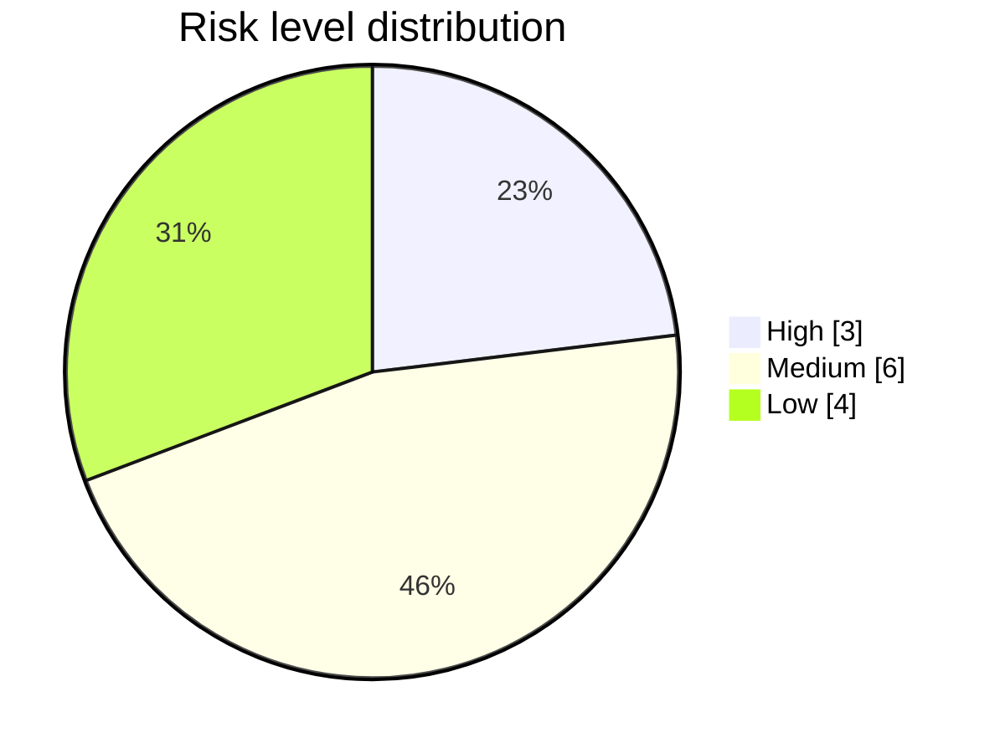

# Risk Analysis Report — Mini-E-Commerce Backend (Django REST)

> _Auto-generated by **AutoTestDesign** (rule engine) for run `run_20260602_163521` on 2026-06-02 16:38:29._
> _Target application: **Mini-E-Commerce Backend (Django REST)**. Design engine: parser=Rule, risk=Rule._

## 1. Report identifier

Risk Analysis Report for run `run_20260602_163521`, concerning the **target application** (Mini-E-Commerce Backend (Django REST)) — not the AutoTestDesign tool.

## 2. Introduction

This report rates the **13** catalogued requirements of the target application by product risk so that test effort can be concentrated where a defect is both likely and damaging (ISTQB 2018; ISO/IEC/IEEE 29119-1). The risk level of each requirement governs its coverage depth downstream.

## 3. Risk assessment method

Each requirement is rated 1–3 on four dimensions — `business_impact`, `failure_probability`, `complexity`, `failure_impact`. The four ratings (sum 4–12) are linearly rescaled to a 1–10 `risk_score`, mapped to a level: 1–3 Low, 4–7 Medium, 8–10 High.

## 4. Risk register

**Table 1.** Requirements ordered by descending risk score.

| Requirement | Feature | Level | Score |
| --- | --- | --- | ---: |
| REQ-009 | The system shall reject an order if requested quantity exceeds availab… | High | 9 |
| REQ-007 | The system shall reject an order if the items array is empty. | High | 8 |
| REQ-008 | The system shall reject an order if customer information is missing. | High | 8 |
| REQ-001 | The system shall display all products with name, description, price, a… | Medium | 7 |
| REQ-003 | The system shall allow admin users to create a new product with name, … | Medium | 7 |
| REQ-010 | The system shall automatically reduce product stock after a successful… | Medium | 7 |
| REQ-012 | The system shall allow admin users to update order status to pending, … | Medium | 7 |
| REQ-006 | The system shall allow users to create an order with one or more produ… | Medium | 6 |
| REQ-011 | The system shall allow users to view order details by order ID. | Medium | 6 |
| REQ-002 | The system shall allow users to view product details by product ID. | Low | 2 |
| REQ-004 | The system shall allow admin users to update an existing product. | Low | 2 |
| REQ-005 | The system shall allow admin users to delete a product. | Low | 2 |
| REQ-013 | Test. | Low | 2 |

## 5. Risk distribution

**Table 2.** Count of requirements per risk level.

| Level | Count | Requirements |
| --- | ---: | --- |
| High | 3 | REQ-007, REQ-008, REQ-009 |
| Medium | 6 | REQ-001, REQ-003, REQ-006, REQ-010, REQ-011, REQ-012 |
| Low | 4 | REQ-002, REQ-004, REQ-005, REQ-013 |

## 6. High-risk items

### 6.1 REQ-009 — The system shall reject an order if requested quantity exceeds availab… (score 9)

- Dimensions — business_impact 3, failure_probability 3, complexity 2, failure_impact 3.
- Rationale — Order and stock logic directly affects core business correctness.
- Test focus — favour boundary, negative and decision-table cases on this requirement.

### 6.2 REQ-007 — The system shall reject an order if the items array is empty. (score 8)

- Dimensions — business_impact 3, failure_probability 3, complexity 1, failure_impact 3.
- Rationale — Order processing is a core business workflow.
- Test focus — favour boundary, negative and decision-table cases on this requirement.

### 6.3 REQ-008 — The system shall reject an order if customer information is missing. (score 8)

- Dimensions — business_impact 3, failure_probability 3, complexity 1, failure_impact 3.
- Rationale — Order processing is a core business workflow.
- Test focus — favour boundary, negative and decision-table cases on this requirement.

## 7. Risk-to-coverage strategy

**High** retains every generated case and favours boundary, negative and decision-table cases; **Medium** keeps one representative per coverage type plus all decision-table cases; **Low** deduplicates by coverage type, always keeping at least one case. The deepest coverage therefore falls on the High-risk items above.

## 8. Mitigation recommendations

| Area | Recommendation |
| --- | --- |
| The system shall reject an order if requested quantity exceeds availab… | Prioritise deep coverage; review the guard/transaction logic that drives its High rating. |
| The system shall reject an order if the items array is empty. | Prioritise deep coverage; review the guard/transaction logic that drives its High rating. |
| The system shall reject an order if customer information is missing. | Prioritise deep coverage; review the guard/transaction logic that drives its High rating. |

## 9. Limitations and approvals

The ratings are model-derived judgements, made reproducible by a fixed combination rule and overridable by the tester before the suite is designed.

## References

- ISO/IEC/IEEE 29119-1:2022, *Software testing — Part 1*.
- IEEE 829-2008, *Standard for Software and System Test Documentation*.
- ISTQB, *Foundation Level Syllabus*, 2018.

