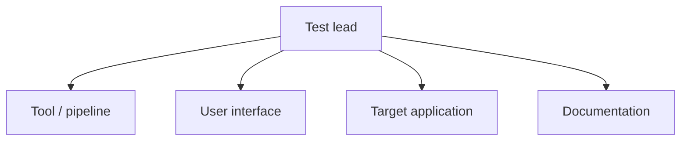

# Test Plan — Mini-E-Commerce Backend (Django REST)

> _Auto-generated by **AutoTestDesign** (rule engine) for run `run_20260602_163521` on 2026-06-02 16:38:29._
> _Target application: **Mini-E-Commerce Backend (Django REST)**. Design engine: parser=Rule, risk=Rule._

## 1. Test plan identifier

Master Test Plan for run `run_20260602_163521`, covering the **target application** (Mini-E-Commerce Backend (Django REST)).

## 2. Introduction

This plan governs verification of the target application using AutoTestDesign, which structured **14** requirements, derived **43** coverage items and generated **71** test cases. Objectives: verify the requirements against the running system; concentrate effort on higher-risk requirements (see the Risk Analysis Report); execute the tool-produced artefacts directly without manual transcription; and detect, repair and re-verify defects. The process has two layers — AutoTestDesign designs the artefacts, PyTest executes them.

## 3. Test items

**Table 1.** Components under test.

| Component / module | Requirements | Risk levels |
| --- | --- | --- |
| Order Processing | REQ-001, REQ-003, REQ-006, REQ-007, REQ-008, REQ-009, REQ-010, REQ-011, REQ-012 | High / Medium |
| Product Management | REQ-002, REQ-004, REQ-005 | Low |
| General | REQ-013, REQ-014 | Low / — |

## 4. Features to be tested

All catalogued functional requirements above are in scope. Non-functional attributes evaluated: **performance** (generation latency), **usability** (the guided Streamlit workflow), **security** (negative cases assert 4xx rejection), and **maintainability** (deterministic engines, unit-tested).

## 5. Features not to be tested

Any behaviour not covered by a catalogued requirement, plus production-scale load/stress testing and deployment, are out of scope for this plan.

## 6. Approach (high-level test suite design)

Suites are organised by component; techniques follow the ISO/IEC/IEEE 29119-4 vocabulary (EP, BVA, DT, ST), selected from risk level and constraint structure.

**Table 2.** Suite-level design.

| Suite | Requirements | Risk level | Techniques | Rationale |
| --- | --- | --- | --- | --- |
| Order Processing | REQ-001, REQ-003, REQ-006, REQ-007, REQ-008, REQ-009, REQ-010, REQ-011, REQ-012 | High / Medium | Decision Table Testing, Boundary Value Analysis, Equivalence Partitioning, State Transition Testing | Depth set by risk level; techniques chosen per constraint structure. |
| Product Management | REQ-002, REQ-004, REQ-005 | Low | Decision Table Testing, Boundary Value Analysis, Equivalence Partitioning | Depth set by risk level; techniques chosen per constraint structure. |
| General | REQ-013, REQ-014 | Low / — | Decision Table Testing, Boundary Value Analysis, Equivalence Partitioning | Depth set by risk level; techniques chosen per constraint structure. |

## 7. Item pass/fail criteria

An item passes when the observed response/state matches its synthesised oracle (expected status and payload assertions); otherwise it fails and is logged for repair.

## 8. Suspension and resumption criteria

Execution is suspended if the backend is unreachable or the unit suite is red, and resumes once both are restored.

## 9. Test deliverables

Data artefacts (CSV / JSON / Excel) in `data/`, and the three Markdown reports (this plan, the risk analysis report, the detailed test design & execution) in `docs/`.

## 10. Testing tasks, schedule and cost

### 10.1 Test levels and schedule

**Table 3.** Test levels and objectives.

| Level | Objective | Location |
| --- | --- | --- |
| Unit | Verify the tool's internal engines | `tests/unit/` |
| Integration | Execute tool-produced artefacts against the live backend | `tests/integration/` |
| System | End-to-end backend behaviour | `tests/integration/` (hand-written) |

**Table 4.** Phase checklist.

| Phase | Activity | Status |
| --- | --- | --- |
| Planning | Scope, risk ranking, framework selection | ☑ |
| Design | Parsing, coverage, test-case generation | ☑ |
| Implementation | PyTest harness and data-driven adapter | ☑ |
| Execution | Run all suites against the backend | ☑ |
| Reporting | Traceability, documentation, packaging | ☐ |

### 10.2 Cost estimation

Effort is estimated from this run's volume — **14** requirements and **71** generated test cases.

**Table 5a.** Effort comparison (person-hours).

| Approach | Basis | Estimated effort |
| --- | --- | ---: |
| Manual design & scripting | 71 cases × 20 min | ≈ 23.7 h |
| AutoTestDesign (review only) | 14 req × 5 min review + ~0 generation | ≈ 1.2 h |
| Saving | manual − tool | ≈ 22.5 h |

The marginal per-project design+execution cost approaches zero. Risk-based optimisation reduced the executable set from 71 to 67 cases (strategy: risk_based_minimization).

**Table 5b.** Measured design-phase pipeline timings (tool-instrumented, wall-clock).

| Stage | Engine | Seconds |
| --- | --- | ---: |
| parse | Rule | 0.025 |
| risk | Rule | 0.004 |
| coverage | rule | 0.002 |
| testcases | rule | 0.016 |
| optimize | rule | 0.004 |
| **Total** |  | 0.051 |

**Document generation metrics** (model-call time and token usage, tool-measured):

| Document | Engine | Gen time (s) | Prompt tok | Completion tok | Total tok |
| --- | --- | ---: | ---: | ---: | ---: |
| risk_analysis_report | rule | 0.001 | 0 | 0 | 0 |
| test_plan | rule | 0.001 | 0 | 0 | 0 |
| detailed_test_design_execution | rule | 0.001 | 0 | 0 | 0 |
| **Total** |  | 0.003 |  |  | 0 |

Estimated LLM token cost: **¥0.0000** at ¥0.0008 / 1k tokens (rule fallback used — no tokens consumed).

## 11. Environmental needs and chosen framework

**Table 6.** Frameworks selected to execute tests on the target application.

| Framework | Used for | Rationale |
| --- | --- | --- |
| PyTest | Test execution | Python de-facto standard; `parametrize` drives the data-driven harness; readable reports. |
| `requests` | HTTP calls to the backend | Simple, explicit; mirrors a real REST client. |
| Django REST Framework | The system under test | The framework the target application is built on. |
| Streamlit | The tool's UI | Interactive editable tables for human-in-the-loop review. |

Selenium and JUnit were considered and rejected: the target is a REST backend with no browser layer, so HTTP-level testing with `requests`+PyTest is more direct, and JUnit does not apply to a Python/Django stack. The backend runs locally on the URL given in the sidebar.

## 12. Responsibilities and staffing

**Table 7.** Roles and responsibilities.

| Role | Responsibilities |
| --- | --- |
| Test lead | Plan ownership, risk sign-off, scheduling |
| Tool / pipeline | Parsing, risk, coverage and test-design engines |
| User interface | Streamlit workflow, export, in-UI runner |
| Target application | Backend, PyTest harness, defect repair and re-test |
| Documentation | Reports, traceability, packaging |

## 13. Risks and contingencies

Product risk is detailed in the Risk Analysis Report. The High-risk requirements requiring the deepest coverage are: REQ-007, REQ-008, REQ-009.

## References

- IEEE 829-2008, *Standard for Software and System Test Documentation*.
- ISO/IEC/IEEE 29119-4:2021, *Test techniques*.
- ISTQB, *Foundation Level Syllabus*, 2018.

